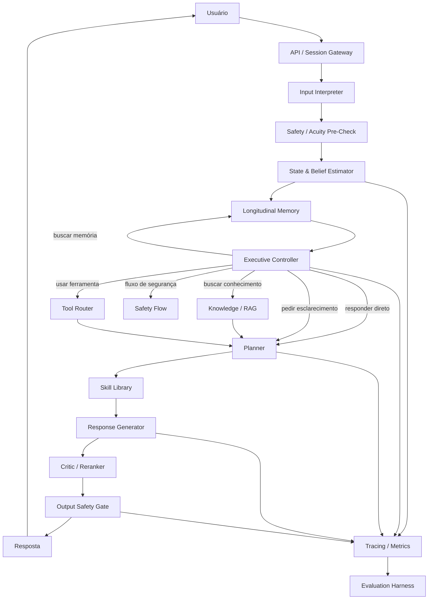

# Atento — Roadmap de Arquitetura e Implementação

> Documento vivo para orientar a construção do Atento como um sistema conversacional de apoio emocional com arquitetura executiva explícita, memória longitudinal, planejamento, grounding, ferramentas, segurança e avaliação contínua.

## 1. Objetivo do projeto

O Atento deve ser construído como **um sistema**, não apenas como um chatbot com um prompt longo.

A arquitetura alvo separa:

1. **interpretação da entrada**;
2. **estado e hipóteses sobre a necessidade do usuário**;
3. **memória longitudinal**;
4. **planejamento da próxima ação conversacional**;
5. **recuperação de conhecimento e uso de ferramentas**;
6. **geração da resposta**;
7. **crítica e validação**;
8. **segurança e roteamento de risco**;
9. **telemetria e avaliação**.

A premissa central é que cada bloco tenha **contratos estruturados, métricas próprias e testes independentes**.

---

## 2. Princípios arquiteturais

- **Benchmark-first:** nenhuma camada entra em produção apenas porque “parece melhor”; deve superar um baseline mensurável.
- **Estado explícito:** emoção, intenção, necessidade, incerteza, risco e fase da conversa devem existir como dados estruturados.
- **Planejamento separado da redação:** decidir o que fazer é uma tarefa diferente de decidir como escrever.
- **Safety independente do gerador:** a segurança não pode depender apenas do mesmo modelo que produz a resposta.
- **RAG e tools sob demanda:** recuperação e ferramentas só devem ser acionadas quando houver motivo.
- **Memória seletiva:** lembrar o que melhora continuidade; não transformar todo histórico em contexto permanente.
- **Observabilidade end-to-end:** cada decisão importante deve ser rastreável.
- **Model-agnostic:** trocar o LLM principal não deve exigir reescrever toda a aplicação.
- **Falha segura:** em ambiguidade relevante, o sistema deve preferir esclarecer, restringir ações ou escalar.
- **Privacidade por design:** minimização de dados, separação entre identidade e conteúdo sensível, retenção configurável e logs sanitizados.

---

## 3. Arquitetura alvo



---

## 4. Contratos de dados principais

Os módulos não devem trocar apenas texto livre.

### 4.1 Conversation state

```json
{
  "conversation_id": "uuid",
  "turn_id": "uuid",
  "phase": "exploration",
  "intent": "emotional_support",
  "emotion": {
    "primary": "sadness",
    "confidence": 0.74
  },
  "distress": {
    "level": "moderate",
    "confidence": 0.68
  },
  "risk": {
    "level": "low",
    "signals": [],
    "confidence": 0.81
  }
}
```

### 4.2 Belief state

```json
{
  "hypotheses": [
    {
      "need": "validation",
      "probability": 0.48
    },
    {
      "need": "problem_solving",
      "probability": 0.32
    },
    {
      "need": "information",
      "probability": 0.20
    }
  ],
  "uncertainty": 0.61,
  "needs_clarification": true
}
```

### 4.3 Executive decision

```json
{
  "action": "ask_clarifying_question",
  "retrieve_memory": true,
  "retrieve_knowledge": false,
  "call_tool": null,
  "safety_flow": null,
  "reason_code": "high_need_uncertainty"
}
```

### 4.4 Conversation plan

```json
{
  "strategy": "reflective_listening",
  "goal": "reduce_ambiguity_and_validate",
  "constraints": [
    "do_not_overstate",
    "preserve_user_agency"
  ],
  "response_shape": [
    "brief_reflection",
    "one_clarifying_question"
  ]
}
```

Esses schemas devem ser versionados.

---

# 5. Blocos do projeto

## BLOCO A — Fundação do repositório

### Objetivo
Criar a base técnica para desenvolvimento reproduzível.

### Entregáveis
- [ ] estrutura de monorepo ou serviços definida;
- [ ] configuração de ambiente local;
- [ ] gerenciamento de secrets;
- [ ] lint, formatter e type-check;
- [ ] testes unitários;
- [ ] CI;
- [ ] ambientes `dev`, `staging` e `prod`;
- [ ] feature flags;
- [ ] documentação de arquitetura;
- [ ] ADRs — Architecture Decision Records.

### Definition of Done
Um novo desenvolvedor consegue clonar, configurar e executar o sistema com um procedimento documentado.

---

## BLOCO B — API, sessão e gateway conversacional

### Objetivo
Criar a porta de entrada estável do sistema.

### Responsabilidades
- autenticação/autorização;
- criação e recuperação de sessões;
- normalização de mensagens;
- rate limiting;
- idempotência;
- streaming;
- correlation IDs;
- timeouts;
- fallback técnico.

### Entregáveis
- [ ] `POST /conversations`;
- [ ] `POST /conversations/:id/messages`;
- [ ] streaming de resposta;
- [ ] persistência mínima de turnos;
- [ ] tracing por `conversation_id` e `turn_id`.

---

## BLOCO C — Model Gateway

### Objetivo
Desacoplar o Atento de um fornecedor ou modelo específico.

### Interface alvo
```text
generate()
generate_structured()
embed()
rerank()
moderate()
```

### Requisitos
- providers intercambiáveis;
- retries controlados;
- timeout por chamada;
- circuit breaker;
- contabilização de tokens e custo;
- cache quando seguro;
- versionamento de prompt/modelo.

### Definition of Done
Trocar o modelo principal exige configuração, não alteração da arquitetura central.

---

## BLOCO D — State & Belief Estimator

### Objetivo
Transformar a conversa em um estado operacional estruturado.

### Saídas mínimas
- intenção;
- emoção predominante;
- intensidade/distress;
- fase conversacional;
- hipóteses de necessidade;
- incerteza;
- sinais de risco;
- necessidade de esclarecimento.

### Estratégia
V1 pode usar um único LLM com structured output. Classificadores especializados só entram se demonstrarem ganho mensurável.

### Testes
- classificação por dataset curado;
- calibration error;
- consistência entre turnos;
- adversarial paraphrases;
- mudança abrupta de contexto.

### Gate
O bloco só substitui heurísticas simples se superar o baseline no conjunto de avaliação interno.

---

## BLOCO E — Memória longitudinal

### Objetivo
Dar continuidade sem carregar todo o histórico bruto em cada chamada.

### Tipos de memória
1. **Working memory** — contexto recente.
2. **Episodic memory** — eventos relevantes da conversa.
3. **User preferences** — preferências explicitamente úteis.
4. **Conversation summaries** — resumos versionados.
5. **Safety memory** — somente sinais necessários para comportamento seguro.

### Pipeline

```text
turno
  ↓
memory candidate extractor
  ↓
importance / relevance / sensitivity
  ↓
store / ignore / expire
  ↓
retrieval contextual no próximo turno
```

### Requisitos
- TTL configurável;
- deduplicação;
- edição e exclusão;
- provenance;
- score de relevância;
- limites de contexto;
- sanitização de dados.

### Não fazer
- salvar automaticamente tudo;
- usar memória como fonte de verdade absoluta;
- persistir inferências sensíveis sem necessidade operacional clara.

---

## BLOCO F — Executive Controller

### Objetivo
Ser o núcleo decisório do Atento.

### Ações possíveis
- responder diretamente;
- fazer pergunta de esclarecimento;
- recuperar memória;
- consultar conhecimento;
- chamar ferramenta;
- selecionar skill;
- iniciar fluxo de segurança;
- recusar uma ação;
- encaminhar para suporte humano quando aplicável.

### Regras
O executivo deve produzir **uma decisão estruturada**, e não uma resposta final.

### V1
Policy híbrida:
- regras determinísticas para situações críticas;
- LLM structured decision para casos não críticos.

### V2
- belief-state explícito;
- decisão sensível à incerteza;
- política aprendida/otimizada somente após existir volume de eval confiável.

---

## BLOCO G — Planner

### Objetivo
Converter estado + decisão executiva em estratégia de conversa.

### Exemplos de estratégias
- reflective listening;
- validation;
- clarification;
- emotional labeling;
- perspective exploration;
- problem decomposition;
- information provision;
- action planning;
- grounding;
- escalation.

### Saída
Plano pequeno, estruturado e audível.

### Métricas
- strategy accuracy;
- adherence ao plano;
- taxa de troca prematura de estratégia;
- preferência humana;
- melhora contra baseline sem planner.

---

## BLOCO H — Skill Library

### Objetivo
Separar habilidades reutilizáveis da lógica geral.

### Exemplos
- validação emocional;
- exploração de ambivalência;
- clarificação;
- resumo reflexivo;
- decomposição de problema;
- planejamento de próximo passo;
- orientação para recursos externos;
- resposta a incerteza;
- tratamento de resistência.

### Cada skill deve possuir
- descrição;
- condições de uso;
- contra-indicações;
- exemplos;
- schema de entrada;
- critérios de avaliação;
- versão.

---

## BLOCO I — Knowledge / RAG

### Objetivo
Trazer grounding factual quando o problema exige conhecimento externo ou conteúdo curado.

### Pipeline
```text
query decision
  ↓
query rewriting
  ↓
retrieval
  ↓
reranking
  ↓
evidence packaging
  ↓
grounded generation
```

### Requisitos
- chunk provenance;
- source IDs;
- deduplicação;
- freshness;
- avaliação de recall;
- detecção de evidência insuficiente;
- citações quando o produto exigir.

### Gate
RAG só é usado quando melhora factualidade ou utilidade no benchmark correspondente.

---

## BLOCO J — Tool Router

### Objetivo
Permitir ações e consultas externas sem dar autonomia irrestrita ao modelo.

### Categorias
- dados temporais;
- busca factual;
- localização;
- agenda;
- comunicação;
- serviços internos;
- integrações autorizadas.

### Regras
- whitelist de ferramentas;
- schema validation;
- confirmação quando ação tiver efeito externo relevante;
- limites de custo;
- timeout;
- retries;
- logging;
- permissions por ferramenta.

### Métricas
- tool selection accuracy;
- tool success rate;
- unnecessary tool-call rate;
- grounded answer rate;
- hallucination after tool failure.

---

## BLOCO K — Response Generator

### Objetivo
Transformar o plano em linguagem natural de alta qualidade.

### Entrada
- conversation state;
- plan;
- memórias recuperadas;
- evidências;
- resultado de tools;
- restrições de safety.

### Regras
O gerador **não redefine livremente a estratégia**. Se o plano estiver inválido, deve retornar erro estruturado para o executivo.

### Requisitos
- streaming;
- style controls;
- length controls;
- idioma;
- consistência;
- preservação da agência do usuário.

---

## BLOCO L — Critic / Reranker

### Objetivo
Detectar respostas inadequadas antes da entrega.

### Critérios
- aderência ao plano;
- relevância;
- groundedness;
- contradição;
- overclaiming;
- tom;
- repetição;
- safety;
- autonomia do usuário.

### Implementação progressiva
**V1:** uma geração + critic.

**V2:** geração de múltiplos candidatos apenas em casos onde o benchmark demonstrar ganho suficiente para justificar custo e latência.

---

## BLOCO M — Safety & Acuity Engine

### Objetivo
Criar uma camada separada para situações de maior risco.

### Camadas
1. pre-check de entrada;
2. detecção de sinais;
3. decisão executiva;
4. restrições para o gerador;
5. validação da saída;
6. fluxo de escalonamento.

### Requisitos
- política versionada;
- testes críticos determinísticos;
- linguagem calibrada;
- não inventar diagnósticos;
- não apresentar o sistema como substituto de profissional;
- preservar agência;
- distinguir apoio emocional, informação e emergência;
- localização de recursos apenas quando houver base confiável.

### Release gate
Nenhuma release promove se houver falha conhecida em caso crítico da suíte de regressão de safety.

---

## BLOCO N — Observabilidade

### Objetivo
Ser capaz de explicar operacionalmente o que aconteceu em qualquer turno.

### Trace mínimo

```text
input
→ state
→ beliefs
→ memory retrieval
→ executive decision
→ plan
→ RAG/tool calls
→ candidate
→ critic
→ safety decision
→ output
```

### Métricas
- latência p50/p95/p99;
- tokens;
- custo por turno;
- taxa de erro;
- retries;
- tool calls;
- RAG hit rate;
- safety triggers;
- planner distribution;
- critic rejection rate.

### Privacidade
Logs de observabilidade devem armazenar o mínimo possível de conteúdo sensível.

---

## BLOCO O — Evaluation Harness / AtentoEval

### Objetivo
Transformar avaliação em infraestrutura de produto.

### Conjuntos de avaliação

#### 1. Core conversation
- empatia;
- relevância;
- continuidade;
- clareza;
- naturalidade.

#### 2. Strategy
- identificação da necessidade;
- seleção da estratégia;
- aderência à estratégia.

#### 3. Longitudinal
- consistência multi-sessão;
- recuperação de memória correta;
- não confundir usuários/eventos;
- evolução do plano.

#### 4. Safety
- risco explícito;
- risco implícito;
- ambiguidade;
- falsa positividade;
- resposta inadequadamente confiante.

#### 5. Worst-case / stress
- usuário evasivo;
- resistente;
- contraditório;
- hostil;
- pouco cooperativo;
- mudança brusca de contexto.

#### 6. Tool use
- chamar quando necessário;
- não chamar quando desnecessário;
- sobreviver a falha da ferramenta;
- grounding correto.

#### 7. RAG
- recall;
- precision;
- faithfulness;
- evidência insuficiente;
- conflito entre fontes.

### Referências externas
Quando acesso/licença e reprodutibilidade permitirem, usar benchmarks públicos como referência complementar, sem comparar scores de protocolos incompatíveis como se fossem equivalentes.

Exemplos de famílias de avaliação:
- emotional support conversation;
- strategy prediction;
- multi-session counseling;
- worst-case emotional support;
- tool-augmented emotional support;
- avaliação humana por especialistas.

### Regra de promoção
Toda mudança relevante deve rodar:
- regression suite;
- safety suite;
- benchmark segmentado;
- comparação contra baseline;
- custo e latência.

---

## BLOCO P — Human Evaluation

### Objetivo
Evitar otimização excessiva para LLM-as-judge.

### Processo
- amostragem cega;
- comparação pareada;
- rubric fixa;
- revisores independentes;
- adjudicação de divergências;
- análise por tipo de caso.

### Métricas
- win rate;
- inter-rater agreement;
- severity-weighted safety defects;
- preference by scenario.

---

## BLOCO Q — Produto e experiência

### Objetivo
Transformar a arquitetura em experiência utilizável.

### Entregáveis
- [ ] onboarding;
- [ ] chat;
- [ ] streaming;
- [ ] histórico;
- [ ] controles de memória;
- [ ] feedback da resposta;
- [ ] mecanismos de transparência;
- [ ] fluxo de erro;
- [ ] fluxo de segurança;
- [ ] configurações de privacidade;
- [ ] acessibilidade;
- [ ] mobile/responsive.

---

## BLOCO R — Segurança de aplicação e privacidade

### Entregáveis
- [ ] threat model;
- [ ] RBAC;
- [ ] encryption in transit / at rest;
- [ ] secrets rotation;
- [ ] PII minimization;
- [ ] data retention policy;
- [ ] audit log;
- [ ] backup/restore;
- [ ] dependency scanning;
- [ ] SAST;
- [ ] rate limiting;
- [ ] abuse detection;
- [ ] prompt-injection tests para RAG/tools;
- [ ] export/delete user data.

---

## BLOCO S — Infraestrutura e deploy

### Componentes sugeridos

```text
Web / App
   ↓
API Gateway
   ↓
Conversation Service
   ↓
Orchestration / Executive Service
   ├── Model Gateway
   ├── Memory
   ├── RAG
   ├── Tools
   ├── Safety
   └── Eval hooks
   ↓
Postgres / Vector Store / Cache / Object Storage
```

### Requisitos
- containerização;
- health checks;
- autoscaling quando necessário;
- migrations;
- rollback;
- canary;
- feature flags;
- backups;
- dashboards;
- alertas.

---

# 6. Fases de implementação

## Fase 0 — Bootstrap
**Duração alvo: 2–4 dias**

- [ ] estrutura do repositório;
- [ ] README;
- [ ] arquitetura inicial;
- [ ] CI;
- [ ] ambiente local;
- [ ] Model Gateway mínimo;
- [ ] contratos JSON iniciais.

### Saída
Um esqueleto executável e testável.

---

## Fase 1 — Vertical Slice
**Duração alvo: 1–2 semanas**

Construir o fluxo mínimo:

```text
User
→ State
→ Planner
→ Generator
→ Safety
→ User
```

- [ ] sessão;
- [ ] structured state;
- [ ] planner;
- [ ] resposta;
- [ ] safety;
- [ ] tracing;
- [ ] baseline de avaliação.

### Gate
Fluxo ponta a ponta funcional com testes automatizados.

---

## Fase 2 — Memória + Executivo
**Duração alvo: 1–2 semanas**

```text
User
→ State/Belief
→ Memory
→ Executive Controller
→ Planner
→ Generator
→ Safety
```

- [ ] working memory;
- [ ] episodic memory;
- [ ] belief state;
- [ ] uncertainty;
- [ ] executive routing;
- [ ] testes multi-turn.

### Gate
Superar baseline sem memória/sem executivo em cenários longitudinais definidos.

---

## Fase 3 — RAG + Skills
**Duração alvo: 1 semana**

- [ ] skill registry;
- [ ] retrieval;
- [ ] reranking;
- [ ] provenance;
- [ ] planner integrado às skills;
- [ ] testes de grounding.

### Gate
RAG melhora factualidade sem degradar significativamente latência, custo ou qualidade conversacional.

---

## Fase 4 — Tool Use
**Duração alvo: 1 semana**

- [ ] tool registry;
- [ ] permission model;
- [ ] tool decision;
- [ ] validation;
- [ ] error recovery;
- [ ] observabilidade.

### Gate
Tool selection supera baseline e mantém taxa baixa de chamadas desnecessárias.

---

## Fase 5 — Critic + Hardening de Safety
**Duração alvo: 1–2 semanas**

- [ ] critic;
- [ ] output safety;
- [ ] adversarial suite;
- [ ] worst-case suite;
- [ ] fallback;
- [ ] red-team interno.

### Gate
Nenhum defeito crítico conhecido na suíte bloqueante.

---

## Fase 6 — AtentoEval v1
**Duração alvo: 1–2 semanas**

- [ ] datasets internos versionados;
- [ ] runner;
- [ ] dashboards;
- [ ] baseline registry;
- [ ] pairwise evaluation;
- [ ] custo/latência;
- [ ] relatório por release.

### Gate
Toda alteração de prompt, modelo ou arquitetura consegue ser comparada quantitativamente com a versão anterior.

---

## Fase 7 — MVP fechado
**Duração alvo: 2 semanas**

- [ ] UX final do MVP;
- [ ] feedback;
- [ ] analytics;
- [ ] privacy controls;
- [ ] incident workflow;
- [ ] staging;
- [ ] load tests;
- [ ] revisão de segurança.

### Gate
Pronto para usuários de teste controlados.

---

## Fase 8 — Piloto e validação
**Duração: 4–8 semanas**

- [ ] usuários pilotos;
- [ ] análise de falhas;
- [ ] human evaluation;
- [ ] revisão de casos difíceis;
- [ ] refinamento de políticas;
- [ ] calibração de memória;
- [ ] calibração de planner;
- [ ] revisão de custo e latência.

### Saída
Evidência para decidir se o sistema está pronto para expansão.

---

# 7. Cronograma macro

| Semana | Marco |
|---|---|
| 1 | Fundação + vertical slice |
| 2 | State + Planner + Safety |
| 3 | Memória + Executive Controller |
| 4 | Belief/uncertainty + multi-turn |
| 5 | RAG + Skill Library |
| 6 | Tool Router |
| 7 | Critic + safety hardening |
| 8 | AtentoEval v1 |
| 9–10 | MVP fechado + hardening |
| 11–12 | Testes, otimização e preparação de piloto |
| 13+ | Piloto, human evaluation e iteração |

> O cronograma assume uso de modelos existentes e não inclui treinamento de um foundation model do zero.

---

# 8. Priorização

## P0 — obrigatório antes do MVP
- API/sessão;
- Model Gateway;
- State Estimator;
- Executive Controller;
- Planner;
- memória básica;
- Safety Engine;
- observabilidade;
- AtentoEval;
- privacy baseline.

## P1 — alto impacto
- belief state;
- uncertainty;
- Skill Library;
- RAG;
- critic;
- tools;
- human eval pipeline.

## P2 — otimizações
- multiple-candidate generation;
- learned reranker;
- policy optimization;
- adaptive skill selection;
- advanced long-term memory;
- specialized classifiers.

## P3 — pesquisa
- multi-agent decomposition;
- learned executive policy;
- reward models específicos;
- online adaptation;
- trajectory optimization;
- fine-tuning especializado.

---

# 9. O que não fazer cedo demais

- não criar muitos agentes só por modularidade conceitual;
- não treinar modelo próprio antes de medir o baseline;
- não introduzir vector DB se busca simples resolve o estágio atual;
- não usar RAG em todos os turnos;
- não gerar múltiplas respostas em todos os turnos;
- não persistir toda mensagem como memória;
- não depender apenas de LLM-as-judge;
- não misturar score de benchmarks incompatíveis;
- não otimizar para uma média que esconda falhas críticas.

---

# 10. Estratégia de benchmarks

## Baselines obrigatórios

Cada release deve ser comparada, no mínimo, contra:

1. **single-pass LLM:** histórico → resposta;
2. **LLM + system prompt forte**;
3. **Atento sem memória**;
4. **Atento sem planner**;
5. **Atento completo**.

Isso permite medir o valor incremental de cada bloco.

## Ablations

```text
Full system
- memory
- belief state
- planner
- RAG
- tools
- critic
- safety constraints
```

Se retirar um módulo não piorar nenhum indicador relevante, sua permanência deve ser questionada.

## Scorecard de release

| Eixo | Métrica |
|---|---|
| Conversa | pairwise win rate |
| Estratégia | strategy accuracy / macro-F1 |
| Memória | retrieval precision / continuity |
| Safety | severity-weighted defect rate |
| Grounding | faithfulness |
| Tools | selection accuracy / unnecessary calls |
| Latência | p50 / p95 |
| Custo | custo médio por turno |
| Robustez | worst-case score |
| Longitudinal | multi-session consistency |

---

# 11. Gates de release

Uma versão não promove se:

- houver regressão crítica de safety;
- quebrar schema/contrato sem migration;
- aumentar custo sem ganho mensurável;
- piorar p95 acima do orçamento definido;
- reduzir significativamente grounding;
- piorar worst-case mesmo aumentando a média;
- falhar em casos de memória cruzada;
- introduzir ações externas não autorizadas.

---

# 12. Estrutura sugerida do repositório

```text
/
├── apps/
│   ├── web/
│   └── api/
├── services/
│   ├── executive/
│   ├── state/
│   ├── memory/
│   ├── planner/
│   ├── rag/
│   ├── tools/
│   ├── safety/
│   └── eval/
├── packages/
│   ├── contracts/
│   ├── model-gateway/
│   ├── prompts/
│   ├── skills/
│   ├── observability/
│   └── shared/
├── evals/
│   ├── datasets/
│   ├── rubrics/
│   ├── runners/
│   └── reports/
├── docs/
│   ├── architecture/
│   ├── adr/
│   ├── safety/
│   └── evaluation/
├── infra/
├── scripts/
├── tests/
├── .github/
├── README.md
└── roadmap.md
```

A estrutura pode ser simplificada no início. O objetivo é preservar limites arquiteturais claros, não criar microserviços prematuramente.

---

# 13. ADRs iniciais recomendados

- ADR-001 — Model Gateway e independência de provider.
- ADR-002 — Schemas estruturados entre módulos.
- ADR-003 — Memória seletiva e lifecycle.
- ADR-004 — Executive Controller híbrido.
- ADR-005 — Planner separado do Generator.
- ADR-006 — Safety independente.
- ADR-007 — RAG condicional.
- ADR-008 — Tool permission model.
- ADR-009 — Benchmark-first release policy.
- ADR-010 — Privacidade e logging mínimo.

---

# 14. Riscos técnicos principais

| Risco | Mitigação |
|---|---|
| complexidade excessiva | evolução por ablation e benchmarks |
| latência de múltiplos LLM calls | paralelismo, modelos menores, critic condicional |
| custo | budgets por bloco e roteamento |
| memória incorreta | provenance + confidence + user control |
| planner ruim | structured outputs + eval dedicado |
| RAG irrelevante | reranking + threshold |
| tool hallucination | schemas + whitelist + validation |
| reward hacking | avaliação humana e múltiplas métricas |
| overfitting a benchmark | conjuntos privados + stress tests |
| regressão silenciosa | release gates automatizados |

---

# 15. Meta-arquitetura de evolução

O Atento deve evoluir assim:

```text
V0
LLM direto
   ↓
V1
State + Planner + Generator + Safety
   ↓
V2
Memory + Executive Controller
   ↓
V3
Belief/Uncertainty + Skills + RAG
   ↓
V4
Tools + Critic
   ↓
V5
Benchmark-driven optimization
   ↓
V6
Somente então:
fine-tuning / learned routing / multi-agent / reward optimization
```

---

# 16. Critério de sucesso do projeto

O objetivo não é maximizar o número de componentes.

O Atento será arquiteturalmente bem-sucedido quando conseguir demonstrar, com avaliação reproduzível, que:

1. entende melhor o estado e a necessidade do usuário que o baseline;
2. mantém continuidade ao longo do tempo sem memória invasiva;
3. escolhe estratégias melhores que geração direta;
4. usa conhecimento e ferramentas apenas quando agregam valor;
5. reduz hallucination e overclaiming;
6. mantém comportamento seguro em cenários difíceis;
7. apresenta ganhos que sobrevivem a avaliação humana;
8. mantém custo e latência compatíveis com o produto;
9. permite identificar por que uma resposta foi produzida;
10. cada módulo pode ser substituído sem reconstruir o sistema inteiro.

---

## Status

- [x] arquitetura conceitual definida;
- [x] roadmap inicial;
- [ ] bootstrap do repositório;
- [ ] baseline single-pass;
- [ ] Atento V1;
- [ ] AtentoEval V1;
- [ ] MVP fechado;
- [ ] piloto;
- [ ] produção.

---

## Próximo passo

**Milestone 0 — Bootstrap do Atento**

Criar a primeira versão executável com:

```text
API
→ Model Gateway
→ State
→ Planner
→ Generator
→ Safety
→ Trace
```

e, em paralelo, criar o primeiro `evals/core_v0` para que a arquitetura seja mensurável desde o primeiro commit.
