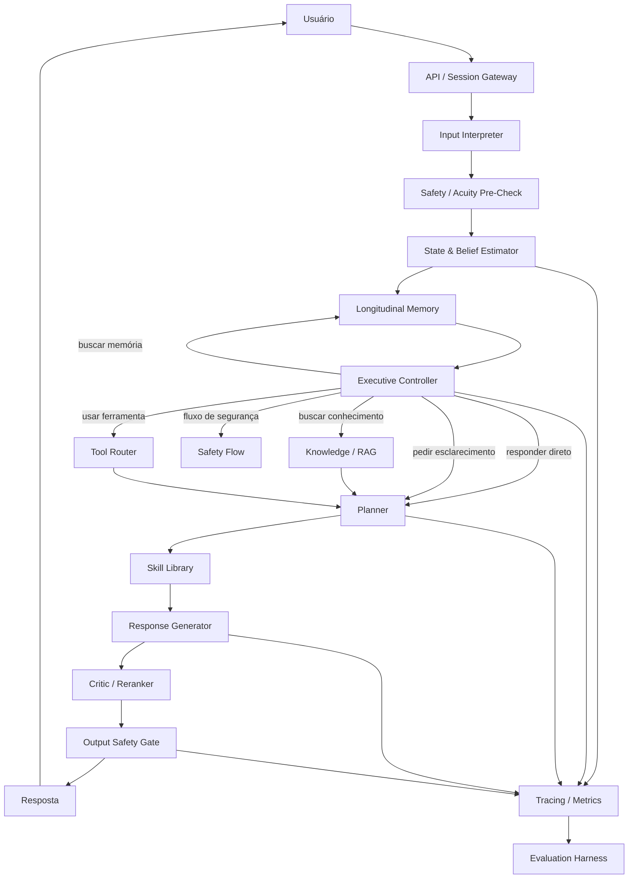

# Atento — Roadmap de Arquitetura e Implementação

> Documento vivo para orientar a construção do Atento como um sistema conversacional de apoio emocional com arquitetura executiva explícita, memória longitudinal, planejamento, grounding, ferramentas, segurança e avaliação contínua.

## 0. Contrato deste documento

Este arquivo é a fonte canônica para:

- escopo do projeto;
- arquitetura alvo em nível de sistema;
- blocos A–S;
- blocos A–S e suas dependências;
- Project Points;
- progresso global do projeto;
- source mapping arquitetural.

Este arquivo **não** é a fonte canônica para:

- detalhes do protocolo de avaliação → `docs/evaluation/harness.md`;
- decisão fork/greenfield → ADR correspondente em `docs/adr/`;
- licença/provenance legal exata → `docs/third-party.md`;
- instruções operacionais para agentes → `AGENTS.md`.

Em caso de duplicação, prevalece o documento que possui a responsabilidade canônica definida em `docs/documentation-map.md`.

> **PROJECT PROGRESS: 3/100 (3%)**
>
> O score representa o **projeto inteiro**. Nenhum bloco individual possui uma porcentagem própria.

## 1. Objetivo do projeto

O Atento deve ser construído como **um sistema**, não apenas como um chatbot com um prompt longo.

A arquitetura alvo separa:

1. **interpretação da entrada**;
2. **estado e hipóteses sobre a necessidade do usuário**;
3. **memória longitudinal**;
4. **planejamento da próxima ação conversacional**;
5. **recuperação de conhecimento e uso de ferramentas**;
6. **geração da resposta**;
7. **crítica e validação**;
8. **segurança e roteamento de risco**;
9. **telemetria e avaliação**.

A premissa central é que cada bloco tenha **contratos estruturados, métricas próprias e testes independentes**.

---

## 2. Princípios arquiteturais

- **Benchmark-first:** nenhuma camada entra em produção apenas porque “parece melhor”; deve superar um baseline mensurável.
- **Estado explícito:** emoção, intenção, necessidade, incerteza, risco e fase da conversa devem existir como dados estruturados.
- **Planejamento separado da redação:** decidir o que fazer é uma tarefa diferente de decidir como escrever.
- **Safety independente do gerador:** a segurança não pode depender apenas do mesmo modelo que produz a resposta.
- **RAG e tools sob demanda:** recuperação e ferramentas só devem ser acionadas quando houver motivo.
- **Memória seletiva:** lembrar o que melhora continuidade; não transformar todo histórico em contexto permanente.
- **Observabilidade end-to-end:** cada decisão importante deve ser rastreável.
- **Model-agnostic:** trocar o LLM principal não deve exigir reescrever toda a aplicação.
- **Falha segura:** em ambiguidade relevante, o sistema deve preferir esclarecer, restringir ações ou escalar.
- **Privacidade por design:** minimização de dados, separação entre identidade e conteúdo sensível, retenção configurável e logs sanitizados.

---


## 2.1 Registro de fontes, provenance e donors

> **Regra operacional:** nenhum módulo, feature, benchmark, dataset, algoritmo ou donor entra sem `SOURCE_ID`. O Atento pode adotar código externo parcialmente ou **na íntegra** quando isso for empiricamente defensável.

### Classes de origem

| Classe | Significado | Uso no Atento |
|---|---|---|
| `IMPLEMENTATION_REFERENCE` | há código executável | pode ser donor parcial ou integral |
| `ARCHITECTURE_REFERENCE` | há arquitetura/paper, mas não runtime reutilizável suficiente | implementar/adaptar quando necessário |
| `BENCHMARK_REFERENCE` | mede uma capacidade | integrar ao AtentoEval sem confundir com runtime |
| `DATA_REFERENCE` | dataset/taxonomia | usar no estudo com provenance |
| `MODEL_REFERENCE` | checkpoint/modelo | testar via Model Gateway ou pipeline próprio |
| `ATENTO_NATIVE` | engenharia própria | usar quando donor não for suficiente ou integração exigir camada local |

### Source Registry

#### SRC-PA — PsychAgent
- **Tipo:** `IMPLEMENTATION_REFERENCE` + `ARCHITECTURE_REFERENCE`.
- **Paper:** https://arxiv.org/abs/2604.00931
- **Repo:** https://github.com/ECNU-ICALK/PsychAgent
- **Commit verificado:** `469f45ef468b968b3fccd1936d7e6a0a574e4c5c`.
- **Candidato para:** memória multi-sessão, planning longitudinal, skill retrieval, reward-guided rollout.
- **Modo permitido:** clone/fork para estudo; full donor somente após spike e AtentoEval.
- **Observação:** partes do pipeline descrito no paper não estão completas na release pública.

#### SRC-PE — PsychEval
- **Tipo:** `BENCHMARK_REFERENCE`.
- **Fonte:** https://aclanthology.org/2026.findings-acl.1115/
- **Candidato para:** multi-session eval, continuidade, planejamento longitudinal e dimensões counselor/client.

#### SRC-CADSS — CADSS / CPsDD
- **Tipo:** `ARCHITECTURE_REFERENCE` + `DATA_REFERENCE`.
- **Paper:** https://ojs.aaai.org/index.php/AAAI/article/view/38825
- **Repo:** https://github.com/FakerBoom/CPsDD
- **Commit verificado:** `f6385fa13223574852bdcff85eb6aa0bd36797dc`.
- **Candidato para:** Profiler → Summarizer → Planner → Supporter.
- **Estado atual:** código CADSS/PGSim não disponível no snapshot verificado; usar arquitetura/dados disponíveis e reavaliar se código for publicado.

#### SRC-UKA — User-Aware Active Knowledge Acquisition
- **Tipo:** `ARCHITECTURE_REFERENCE`.
- **Fonte:** https://arxiv.org/abs/2605.29715
- **Candidato para:** belief state, hipóteses de necessidade, incerteza, clarificação ativa.

#### SRC-SAGE — Self-Retrieval-Augmented Generative LLM for ESC
- **Tipo:** `ARCHITECTURE_REFERENCE`.
- **Fonte:** https://doi.org/10.1016/j.eswa.2026.131524
- **Candidato para:** strategy prediction, retrieval, reranking e generation.
- **Regra:** implementação literal ou adaptação são permitidas no estudo se houver material disponível e o AtentoEval justificar.

#### SRC-TEA — TEA-Bench
- **Tipo:** `BENCHMARK_REFERENCE` + `ARCHITECTURE_REFERENCE`.
- **Paper:** https://aclanthology.org/2026.acl-long.2152/
- **Repo:** https://github.com/XingYuSSS/TEA-Bench
- **Candidato para:** tool routing, grounding, process-trace eval e failure injection.

#### SRC-ENPMR — ENPMR-Bench
- **Tipo:** `BENCHMARK_REFERENCE` + `ARCHITECTURE_REFERENCE`.
- **Fonte:** https://aclanthology.org/2026.findings-acl.2080/
- **Candidato para:** emotional-need inference e proactive memory retrieval.

#### SRC-ESCONV — ESConv
- **Tipo:** `DATA_REFERENCE` + `BENCHMARK_REFERENCE`.
- **Paper:** https://aclanthology.org/2021.acl-long.269/
- **Repo:** https://github.com/thu-coai/Emotional-Support-Conversation
- **Candidato para:** strategy taxonomy, prediction e ESC evaluation.

#### SRC-MHB — MentalHealthBench
- **Tipo:** `BENCHMARK_REFERENCE`.
- **Fonte:** https://openai.com/index/introducing-mentalhealthbench/
- **Candidato para:** safety, context seeking, user agency, actionability e acuity slices.

#### SRC-COUNSEL — CounselBench
- **Tipo:** `BENCHMARK_REFERENCE`.
- **Paper:** https://proceedings.iclr.cc/paper_files/paper/2026/hash/99946cb64d51ead9d3969db0af65ca2e-Abstract-Conference.html
- **Repo:** https://github.com/llm-eval-mental-health/CounselBench
- **Candidato para:** expert evaluation, adversarial failure modes e judge calibration.

#### SRC-PSYCHAT — PsyChat Agentic RAG
- **Tipo:** `IMPLEMENTATION_REFERENCE` + `ARCHITECTURE_REFERENCE`.
- **Repo:** https://github.com/wink-wink-wink555/PsyChat
- **Commit verificado:** `5bf6f806e0f30e45b4e1dd72282fd6afd83b66f4`.
- **Candidato para:** Agentic RAG, RAG decision, query rewrite, multi-query retrieval, context expansion e FastAPI prototype.
- **Modo permitido:** `FULL_DONOR`, fork ou selective port.
- **Condição:** comparar upstream, donor adaptado e alternativa nativa no mesmo AtentoEval.

#### SRC-THERAPYMIND — TherapyMind
- **Tipo:** `IMPLEMENTATION_REFERENCE` + `ARCHITECTURE_REFERENCE`.
- **Repo:** https://github.com/zx070326-hash/TherapyMind
- **Commit verificado:** `bfed3f5be61bab262bb00a0f3cc9718c4a965243`.
- **Candidato para:** modular prompt compilation, 4-role review chain, safety prompt structure, grey-zone tests e profile/session persistence.
- **Modo permitido:** `FULL_DONOR`, fork ou selective port, desde que supere baseline relevante.

#### SRC-SOULCHAT — SoulChat2.0 / PsyDT
- **Tipo:** `IMPLEMENTATION_REFERENCE` + `MODEL_REFERENCE`.
- **Repo:** https://github.com/scutcyr/SoulChat2.0
- **Commit verificado:** `13ec529c9e3851eacbbf09bec9029621ac40e773`.
- **Candidato para:** specialized generator, fine-tuning, style/technique personalization.
- **Modo permitido:** model adapter, donor de training pipeline ou full donor se o benchmark justificar.

#### SRC-EMOLLM — EmoLLM
- **Tipo:** `IMPLEMENTATION_REFERENCE` + `MODEL_REFERENCE`.
- **Repo:** https://github.com/SmartFlowAI/EmoLLM
- **Candidato para:** checkpoints, fine-tuning recipes, deploy e RAG experiments.
- **Modo permitido:** model adapter, pipeline donor ou full donor se empiricamente vantajoso.

#### SRC-MINDCHAT — MindChat
- **Tipo:** `IMPLEMENTATION_REFERENCE` + `MODEL_REFERENCE`.
- **Repo:** https://github.com/X-D-Lab/MindChat
- **Commit verificado:** `8309768d156a3c0e719381705a4058fa1ec554d3`.
- **Candidato para:** specialized model comparison e local deployment.
- **Modo permitido:** clone/fork/model adapter/full donor para estudo; registrar os termos externos em `docs/third-party.md`.

#### SRC-ATENTO — Arquitetura própria do Atento
- **Tipo:** `ATENTO_NATIVE`.
- **Usar para:** contratos, integration glue, policy composition, privacy, RBAC, observabilidade, CI/CD, infraestrutura e componentes sem donor superior comprovado.

### Matriz de provenance por módulo/feature

| Módulo / feature | Donor/Referência primária | Referência secundária | Regra de adoção |
|---|---|---|---|
| Session/API | `SRC-ATENTO` | `SRC-PSYCHAT` | donor permitido se reduzir esforço sem degradar contratos |
| State/Profile | `SRC-CADSS` | `SRC-UKA`, `SRC-MHB` | copiar/adaptar implementação disponível ou construir local |
| Belief/uncertainty | `SRC-UKA` | `SRC-ENPMR` | implementar/adaptar conforme evidência |
| Longitudinal memory | `SRC-PA` | `SRC-ENPMR`, `SRC-PE` | donor integral/parcial permitido se testável |
| Executive Controller | `SRC-ATENTO` | `SRC-PA`, `SRC-CADSS`, `SRC-UKA`, `SRC-TEA` | composição própria ou donor que cubra a maioria das funções |
| Planner | `SRC-CADSS` | `SRC-SAGE`, `SRC-ESCONV`, `SRC-PA` | donor/adaptação permitidos |
| Skill Library | `SRC-PA` | `SRC-ESCONV` | donor/adaptação permitidos; V1 limitada às skills aprovadas |
| RAG | `SRC-PSYCHAT`, `SRC-SAGE` | `SRC-UKA` | full donor de PsyChat é candidato explícito |
| Tools | `SRC-TEA` | `SRC-ATENTO` | adaptar benchmark patterns; runtime pode ser nativo ou donor |
| Generator | `SRC-SOULCHAT`, `SRC-EMOLLM`, `SRC-MINDCHAT` | `SRC-CADSS` | comparar via Model Gateway; full donor permitido |
| Critic/Reranker | `SRC-SAGE`, `SRC-PA` | `SRC-COUNSEL` | donor/adaptação condicionados a ablation |
| Safety | `SRC-ATENTO` | `SRC-MHB`, `SRC-COUNSEL`, `SRC-THERAPYMIND` | donor pode fornecer partes, mas gate final permanece independente/testável |
| AtentoEval | `SRC-ATENTO` | todos os benchmarks | preservar protocolos; adapters próprios ou copiados quando vantajoso |

### Provenance obrigatório para donor

Quando código externo for copiado integralmente ou parcialmente, registrar:

```yaml
source_id:
adoption_mode: FULL_DONOR | FORK | SELECTIVE_PORT | MODEL_ADAPTER
upstream_repo:
upstream_commit:
copied_paths:
modified_paths:
removed_paths:
local_wrapper:
atentoeval_report:
upstream_sync_strategy:
external_terms_note:
```

---

## 2.2 Gate obrigatório: donor vs fork vs selective-port vs native

> **Este gate acontece antes da migração arquitetural dos blocos.** A pergunta não é "podemos copiar?", e sim "qual opção é empiricamente melhor para o Atento?".

### Critérios de decisão

Pontuar/medir:

1. benchmark evidence;
2. architecture fit;
3. code maturity;
4. modularity;
5. safety separation;
6. provider coupling;
7. observability/testability;
8. migration effort;
9. latency/cost;
10. change-surface / maintenance effort.

### Regra de decisão

- **FULL_DONOR** é aceitável quando o projeto externo entrega a maior parte da capacidade necessária e os resultados justificam herdar sua base.
- **FORK** é preferível ao copy-paste quando acompanhar upstream agrega valor.
- **SELECTIVE_PORT** é preferível quando poucas peças são claramente superiores.
- **MODEL_ADAPTER** é preferível quando o valor está principalmente nos pesos.
- **ATENTO_NATIVE** é preferível quando integração/refatoração do donor custa mais que implementar o contrato.
- **HYBRID** é permitido e esperado quando diferentes donors dominam diferentes componentes.

Nenhuma opção ganha por ideologia. O resultado é decidido por evidência.

### Spike mínimo

Para todo donor candidato a base:

- executar upstream;
- capturar baseline;
- rodar 20–50 casos seed no mínimo;
- medir quality/safety/cost/latency;
- mapear acoplamentos;
- implementar o menor adapter necessário;
- comparar com alternativa relevante;
- registrar resultado na ADR.

### PsyChat como primeiro donor executável

Comparar:

```text
PsyChat upstream
vs
PsyChat full-donor adaptado
vs
Atento vertical slice nativo
```

Não existe mais regra fixa de "40% de código sobrevivente". O critério é ganho sistêmico mensurável.

### Donors sem termos claros

Podem ser clonados/executados para estudo e comparação. Para incorporar integralmente ao repositório e redistribuir, registrar os termos externos e manter a estratégia compatível com eles. Isso não invalida o donor tecnicamente; apenas define como ele é armazenado/distribuído.

### ADR obrigatório

A ADR deve registrar:

```yaml
decision: full-donor | fork | selective-port | native | hybrid | model-adapter
candidate:
upstream_repo:
upstream_commit:
architecture_fit:
benchmark_evidence:
atentoeval_result:
modules_reused:
modules_replaced:
estimated_effort_donor:
estimated_effort_native:
latency_delta:
cost_delta:
safety_delta:
upstream_sync_strategy:
external_terms_note:
decision_rationale:
```

---

## 3. Arquitetura alvo



---

## 4. Contratos de dados principais

Os módulos não devem trocar apenas texto livre.

### 4.1 Conversation state

```json
{
  "conversation_id": "uuid",
  "turn_id": "uuid",
  "phase": "exploration",
  "intent": "emotional_support",
  "emotion": {
    "primary": "sadness",
    "confidence": 0.74
  },
  "distress": {
    "level": "moderate",
    "confidence": 0.68
  },
  "risk": {
    "level": "low",
    "signals": [],
    "confidence": 0.81
  }
}
```

### 4.2 Belief state

```json
{
  "hypotheses": [
    {
      "need": "validation",
      "probability": 0.48
    },
    {
      "need": "problem_solving",
      "probability": 0.32
    },
    {
      "need": "information",
      "probability": 0.20
    }
  ],
  "uncertainty": 0.61,
  "needs_clarification": true
}
```

### 4.3 Executive decision

```json
{
  "action": "ask_clarifying_question",
  "retrieve_memory": true,
  "retrieve_knowledge": false,
  "call_tool": null,
  "safety_flow": null,
  "reason_code": "high_need_uncertainty"
}
```

### 4.4 Conversation plan

```json
{
  "strategy": "reflective_listening",
  "goal": "reduce_ambiguity_and_validate",
  "constraints": [
    "do_not_overstate",
    "preserve_user_agency"
  ],
  "response_shape": [
    "brief_reflection",
    "one_clarifying_question"
  ]
}
```

Esses schemas devem ser versionados.

---

# 5. Blocos do projeto


## 5.0 Project Point Model — 100 pontos do projeto inteiro

O progresso do Atento é medido por **100 Project Points verificáveis**.

### Regra

```text
PROJECT PROGRESS = quantidade de Project Points [x] / 100
```

Os pontos são do **projeto inteiro**. Os blocos apenas recebem uma quantidade de pontos proporcional à sua contribuição arquitetural.

| Bloco | Project Points | Papel |
|---|---:|---|
| A — Fundação | 3 | governança e base técnica |
| B — API/Sessão | 4 | entrada e sessão |
| C — Model Gateway | 4 | abstração de modelos |
| D — State & Belief | 7 | percepção/estado |
| E — Memória | 7 | continuidade |
| F — Executive Controller | 8 | decisão executiva |
| G — Planner | 6 | estratégia |
| H — Skill Library | 3 | habilidades |
| I — RAG | 5 | conhecimento |
| J — Tools | 5 | ações/grounding |
| K — Generator | 5 | resposta |
| L — Critic | 4 | validação/reranking |
| M — Safety | 9 | segurança conversacional |
| N — Observabilidade | 5 | auditabilidade |
| O — AtentoEval | 8 | medição |
| P — Human Evaluation | 3 | validação humana |
| Q — Produto/UX | 4 | experiência |
| R — AppSec/Privacidade | 6 | segurança da aplicação |
| S — Infra/Deploy | 4 | operação |
| **TOTAL** | **100** | **projeto inteiro** |

Os Project Points são **métrica de evolução do projeto**, não unidades de trabalho, prompts, sprints ou etapas de migração.

> **Unidade de migração = BLOCO inteiro (A–S).**
>
> O agente não deve transformar os Project Points de um bloco em uma sequência artificial de prompts. Os pontos existem para medir evidência dentro do bloco; a migração/implementação é conduzida pelo bloco como uma responsabilidade arquitetural coerente.

### Project Point Ledger

#### A — Fundação — 3 pontos
- [x] **A1** — governança de arquitetura, roadmap, ADR framework, provenance e regras de agente definidos.
- [ ] **A2** — ambiente local reproduzível + secrets + lint + formatter + type-check + test bootstrap.
- [ ] **A3** — CI e onboarding reproduzível com ambientes básicos definidos.

#### B — API/Sessão — 4 pontos
- [ ] **B1** — contrato de conversations/sessions e endpoints principais.
- [ ] **B2** — streaming + idempotência + rate limit + correlation IDs/timeouts.
- [ ] **B3** — persistência e recuperação de sessão/turnos.
- [ ] **B4** — contract/integration tests do gateway conversacional.

#### C — Model Gateway — 4 pontos
- [ ] **C1** — interface canônica `generate/generate_structured/embed/rerank/moderate`.
- [ ] **C2** — pelo menos um provider adapter funcional sem acoplamento de domínio.
- [ ] **C3** — retries + timeout + circuit breaker/fallback explícito.
- [ ] **C4** — usage/cost/model-version tracing + contract tests.

#### D — State & Belief — 7 pontos
- [ ] **D1** — schema versionado de conversation state.
- [ ] **D2** — intent + emotion + distress como sinais operacionais.
- [ ] **D3** — need hypotheses/belief state estruturado.
- [ ] **D4** — uncertainty + `needs_clarification` com policy explícita.
- [ ] **D5** — integração de risk signals sem transformar sinal em diagnóstico.
- [ ] **D6** — calibration/eval de state e belief.
- [ ] **D7** — testes multi-turn/adversariais de drift e inconsistência.

#### E — Memória — 7 pontos
- [ ] **E1** — schema/tipos de memória e provenance.
- [ ] **E2** — working memory.
- [ ] **E3** — episodic/cross-session memory.
- [ ] **E4** — summaries/preferences com lifecycle explícito.
- [ ] **E5** — retrieval por relevância + necessidade + sensibilidade.
- [ ] **E6** — TTL/delete/deduplicação/controle de usuário.
- [ ] **E7** — longitudinal eval + cross-user isolation gate.

#### F — Executive Controller — 8 pontos
- [ ] **F1** — schema de executive decision/actions.
- [ ] **F2** — rule layer para rotas críticas.
- [ ] **F3** — decisão LLM estruturada para casos não críticos.
- [ ] **F4** — routing de memória.
- [ ] **F5** — routing de RAG/knowledge.
- [ ] **F6** — routing de tools.
- [ ] **F7** — routing de safety/escalation/clarification.
- [ ] **F8** — eval + tracing do executivo.

#### G — Planner — 6 pontos
- [ ] **G1** — schema de conversation plan.
- [ ] **G2** — taxonomia interna versionada e mapeada às fontes.
- [ ] **G3** — strategy selection.
- [ ] **G4** — constraints/goal/response-shape e adherence.
- [ ] **G5** — planner eval independente do generator.
- [ ] **G6** — fallback/versioning e regressão.

#### H — Skill Library — 3 pontos
- [ ] **H1** — skill registry/schema/version.
- [ ] **H2** — biblioteca inicial com condições/contra-indicações.
- [ ] **H3** — skill retrieval + eval.

#### I — Knowledge/RAG — 5 pontos
- [ ] **I1** — corpus/chunk/provenance pipeline.
- [ ] **I2** — query rewrite + retrieval.
- [ ] **I3** — reranking + evidence packaging.
- [ ] **I4** — RAG condicional + insufficient/conflicting evidence behavior.
- [ ] **I5** — RAG eval de recall/precision/faithfulness.

#### J — Tool Router — 5 pontos
- [ ] **J1** — tool registry + schemas.
- [ ] **J2** — permissions + confirmation model.
- [ ] **J3** — execution + timeout/retry/error recovery.
- [ ] **J4** — grounding e tratamento de tool output como conteúdo não confiável.
- [ ] **J5** — tool-use eval incluindo unnecessary call e failure injection.

#### K — Response Generator — 5 pontos
- [ ] **K1** — generator contract separado do planner.
- [ ] **K2** — model/provider via Model Gateway.
- [ ] **K3** — condicionamento a plan/evidence/memory autorizada.
- [ ] **K4** — streaming + idioma/style/length controls.
- [ ] **K5** — generator eval + fallback.

#### L — Critic/Reranker — 4 pontos
- [ ] **L1** — critic schema/rubric.
- [ ] **L2** — checks de adherence/grounding/repetition/safety.
- [ ] **L3** — reranking/candidate logic condicional.
- [ ] **L4** — critic eval + custo/latência.

#### M — Safety — 9 pontos
- [ ] **M1** — safety policy versionada.
- [ ] **M2** — input pre-check independente.
- [ ] **M3** — risk/acuity routing.
- [ ] **M4** — constraints para geração.
- [ ] **M5** — output safety gate.
- [ ] **M6** — high-acuity/urgent-support flow.
- [ ] **M7** — ambiguidade + false-positive controls.
- [ ] **M8** — adversarial/red-team safety suite.
- [ ] **M9** — release gate com zero falha crítica conhecida na suite bloqueante.

#### N — Observabilidade — 5 pontos
- [ ] **N1** — trace schema end-to-end.
- [ ] **N2** — latency/token/cost metrics.
- [ ] **N3** — eventos de state/executive/plan/RAG/tool/safety.
- [ ] **N4** — sanitização/privacy de traces.
- [ ] **N5** — reproducibility manifest + dashboards/alerts básicos.

#### O — AtentoEval — 8 pontos
- [x] **O1** — arquitetura/especificação do harness definida.
- [x] **O2** — schema + scorer/runner offline implementados.
- [ ] **O3** — registry/system matrix/release gates/seed cases com testes executados em CI/local.
- [ ] **O4** — adapter do runtime Atento.
- [ ] **O5** — deterministic process metrics completos.
- [ ] **O6** — judge interface + pairwise/human-review export.
- [ ] **O7** — adapters de benchmarks externos prioritários.
- [ ] **O8** — release report reproduzível candidato vs baseline.

#### P — Human Evaluation — 3 pontos
- [ ] **P1** — rubric/reviewer protocol.
- [ ] **P2** — blind pairwise + adjudication workflow.
- [ ] **P3** — inter-rater/reports + calibração de judges.

#### Q — Produto/UX — 4 pontos
- [ ] **Q1** — onboarding + chat + streaming.
- [ ] **Q2** — histórico + controles de memória.
- [ ] **Q3** — feedback + transparência + safety UX.
- [ ] **Q4** — acessibilidade + responsive + error/fallback flows.

#### R — AppSec/Privacidade — 6 pontos
- [ ] **R1** — threat model + auth/RBAC.
- [ ] **R2** — encryption/secrets lifecycle.
- [ ] **R3** — retention + export/delete data.
- [ ] **R4** — audit + backup/restore.
- [ ] **R5** — dependency/SAST/abuse/prompt-injection protections.
- [ ] **R6** — security review/release gates.

#### S — Infra/Deploy — 4 pontos
- [ ] **S1** — containers/env/migrations.
- [ ] **S2** — health checks + rollback/canary/autoscaling policy.
- [ ] **S3** — backups + monitoring + alerts.
- [ ] **S4** — staging/prod deployment runbook.

### Regra para ganhar um Project Point

Um item só muda de `[ ]` para `[x]` quando existir **evidência verificável** compatível com o verbo do item:

- implementação → código + testes;
- comportamento → eval/test executado;
- gate → resultado do gate;
- decisão → ADR aceita;
- integração → execução ponta a ponta;
- documentação/governança → documento canônico versionado.

Código não executado não prova comportamento. Teste escrito mas não executado não prova passagem.

---


## BLOCO A — Fundação do repositório

### Origem / provenance
- **Fonte:** `SRC-ATENTO`.
- **Importar/copiar:.
- **Implementação:** engenharia nativa do projeto.
- **Validação:** CI, reproducibilidade do setup e testes de bootstrap.

### Objetivo
Criar a base técnica para desenvolvimento reproduzível.

### Entregáveis
- [ ] estrutura de monorepo ou serviços definida;
- [ ] configuração de ambiente local;
- [ ] gerenciamento de secrets;
- [ ] lint, formatter e type-check;
- [ ] testes unitários;
- [ ] CI;
- [ ] ambientes `dev`, `staging` e `prod`;
- [ ] feature flags;
- [ ] documentação de arquitetura;
- [ ] ADRs — Architecture Decision Records.

### Definition of Done
Um novo desenvolvedor consegue clonar, configurar e executar o sistema com um procedimento documentado.

---


## BLOCO B — API, sessão e gateway conversacional

### Origem / provenance
- **Fonte:** `SRC-ATENTO`.
- **Importar/copiar:** nada.
- **Implementação:** contrato de produto próprio; deve apenas transportar estado/IDs e nunca embutir lógica de aconselhamento.
- **Validação:** testes de sessão, idempotência, streaming, rate limit e falhas.

### Objetivo
Criar a porta de entrada estável do sistema.

### Responsabilidades
- autenticação/autorização;
- criação e recuperação de sessões;
- normalização de mensagens;
- rate limiting;
- idempotência;
- streaming;
- correlation IDs;
- timeouts;
- fallback técnico.

### Entregáveis
- [ ] `POST /conversations`;
- [ ] `POST /conversations/:id/messages`;
- [ ] streaming de resposta;
- [ ] persistência mínima de turnos;
- [ ] tracing por `conversation_id` e `turn_id`.

---


## BLOCO C — Model Gateway

### Origem / provenance
- **Fonte:** `SRC-ATENTO`.
- **Importar/copiar:** nada de PsychAgent/CADSS; seus endpoints são apenas referências de integração.
- **Implementação:** adapter próprio para providers OpenAI-compatible e/ou outros providers escolhidos.
- **Validação:** contract tests e fallback/provider switching.

### Objetivo
Desacoplar o Atento de um fornecedor ou modelo específico.

### Interface alvo
```text
generate()
generate_structured()
embed()
rerank()
moderate()
```

### Requisitos
- providers intercambiáveis;
- retries controlados;
- timeout por chamada;
- circuit breaker;
- contabilização de tokens e custo;
- cache quando seguro;
- versionamento de prompt/modelo.

### Definition of Done
Trocar o modelo principal exige configuração, não alteração da arquitetura central.

---


## BLOCO D — State & Belief Estimator

### Origem / provenance
- **Profiler + summary/state:** `SRC-CADSS`.
- **Belief hypotheses + uncertainty:** `SRC-UKA`.
- **Need-aware signals para memória:** `SRC-ENPMR`.
- **Taxonomia emocional/strategy context:** `SRC-ESCONV`.
- **Risk/acuity:** `SRC-ATENTO`, validado por `SRC-MHB` e `SRC-COUNSEL`.
- **Implementação:** clean-room em schema próprio. Não criar um agente separado por subcampo na V1.

### Objetivo
Transformar a conversa em um estado operacional estruturado.

### Saídas mínimas
- intenção;
- emoção predominante;
- intensidade/distress;
- fase conversacional;
- hipóteses de necessidade;
- incerteza;
- sinais de risco;
- necessidade de esclarecimento.

### Estratégia
V1 pode usar um único LLM com structured output. Classificadores especializados só entram se demonstrarem ganho mensurável.

### Testes
- classificação por dataset curado;
- calibration error;
- consistência entre turnos;
- adversarial paraphrases;
- mudança abrupta de contexto.

### Gate
O bloco só substitui heurísticas simples se superar o baseline no conjunto de avaliação interno.

---


## BLOCO E — Memória longitudinal

### Origem / provenance
- **Cross-session continuity + memory/planning:** `SRC-PA`.
- **Need-aware proactive retrieval:** `SRC-ENPMR`.
- **Critério multi-sessão:** `SRC-PE`.
- **Lifecycle/TTL/privacy/storage:** `SRC-ATENTO`.
- **Implementação:** própria. PsychAgent está sem licença de repo verificada; não copiar código.

### Objetivo
Dar continuidade sem carregar todo o histórico bruto em cada chamada.

### Tipos de memória
1. **Working memory** — contexto recente.
2. **Episodic memory** — eventos relevantes da conversa.
3. **User preferences** — preferências explicitamente úteis.
4. **Conversation summaries** — resumos versionados.
5. **Safety memory** — somente sinais necessários para comportamento seguro.

### Pipeline

```text
turno
  ↓
memory candidate extractor
  ↓
importance / relevance / sensitivity
  ↓
store / ignore / expire
  ↓
retrieval contextual no próximo turno
```

### Requisitos
- TTL configurável;
- deduplicação;
- edição e exclusão;
- provenance;
- score de relevância;
- limites de contexto;
- sanitização de dados.

### Não fazer
- salvar automaticamente tudo;
- usar memória como fonte de verdade absoluta;
- persistir inferências sensíveis sem necessidade operacional clara.

---


## BLOCO F — Executive Controller

### Origem / provenance
- **Integração final:** `SRC-ATENTO`.
- **Decisão sob incerteza / perguntar:** `SRC-UKA`.
- **Decisão de usar ferramentas:** `SRC-TEA`.
- **Decomposição profile/summary/plan/response:** `SRC-CADSS`.
- **Memória/plano longitudinal:** `SRC-PA`.
- **Nota:** nenhuma fonte acima contém exatamente o Executive Controller do Atento. Este módulo é uma síntese própria com contratos explícitos.

### Objetivo
Ser o núcleo decisório do Atento.

### Ações possíveis
- responder diretamente;
- fazer pergunta de esclarecimento;
- recuperar memória;
- consultar conhecimento;
- chamar ferramenta;
- selecionar skill;
- iniciar fluxo de segurança;
- recusar uma ação;
- encaminhar para suporte humano quando aplicável.

### Regras
O executivo deve produzir **uma decisão estruturada**, e não uma resposta final.

### V1
Policy híbrida:
- regras determinísticas para situações críticas;
- LLM structured decision para casos não críticos.

### V2
- belief-state explícito;
- decisão sensível à incerteza;
- política aprendida/otimizada somente após existir volume de eval confiável.

---


## BLOCO G — Planner

### Origem / provenance
- **Strategy prediction / planner separado:** `SRC-CADSS`.
- **Strategy-aware selection/retrieval/reranking:** `SRC-SAGE`.
- **Taxonomia base de suporte:** `SRC-ESCONV`.
- **Planejamento longitudinal:** `SRC-PA`.
- **Implementação:** clean-room e model-agnostic; output estruturado.

### Objetivo
Converter estado + decisão executiva em estratégia de conversa.

### Exemplos de estratégias
- reflective listening;
- validation;
- clarification;
- emotional labeling;
- perspective exploration;
- problem decomposition;
- information provision;
- action planning;
- grounding;
- escalation.

### Saída
Plano pequeno, estruturado e audível.

### Métricas
- strategy accuracy;
- adherence ao plano;
- taxa de troca prematura de estratégia;
- preferência humana;
- melhora contra baseline sem planner.

---


## BLOCO H — Skill Library

### Origem / provenance
- **Skill retrieval/library:** `SRC-PA`.
- **Vocabulário inicial de estratégias:** `SRC-ESCONV` + `SRC-CADSS`.
- **Skill evolution automática:** somente P3, inspirada em `SRC-PA`; a release pública verificada não traz o pipeline completo.
- **Implementação:** registry próprio; conteúdo deve ter autoria/licença rastreável.

### Objetivo
Separar habilidades reutilizáveis da lógica geral.

### Exemplos
- validação emocional;
- exploração de ambivalência;
- clarificação;
- resumo reflexivo;
- decomposição de problema;
- planejamento de próximo passo;
- orientação para recursos externos;
- resposta a incerteza;
- tratamento de resistência.

### Cada skill deve possuir
- descrição;
- condições de uso;
- contra-indicações;
- exemplos;
- schema de entrada;
- critérios de avaliação;
- versão.

---


## BLOCO I — Knowledge / RAG

### Origem / provenance
- **Strategy-aware retrieval/reranking:** `SRC-SAGE`.
- **Query/knowledge decision sob incerteza:** `SRC-UKA`.
- **Grounding e avaliação de informação externa:** `SRC-TEA`.
- **Storage, chunking, provenance e retrieval stack:** `SRC-ATENTO`.
- **Implementação:** simples primeiro; não reproduzir arquitetura neural específica do SAGE sem ablation favorável.

### Objetivo
Trazer grounding factual quando o problema exige conhecimento externo ou conteúdo curado.

### Pipeline
```text
query decision
  ↓
query rewriting
  ↓
retrieval
  ↓
reranking
  ↓
evidence packaging
  ↓
grounded generation
```

### Requisitos
- chunk provenance;
- source IDs;
- deduplicação;
- freshness;
- avaliação de recall;
- detecção de evidência insuficiente;
- citações quando o produto exigir.

### Gate
RAG só é usado quando melhora factualidade ou utilidade no benchmark correspondente.

---


## BLOCO J — Tool Router

### Origem / provenance
- **Capacidade e protocolo principal:** `SRC-TEA`.
- **confirmação, schemas, retries e segurança operacional:** `SRC-ATENTO`.
- **Incerteza que pode justificar consulta:** `SRC-UKA`.
- **copia/Implementação:** própria; TEA-Bench é referência de capacidade/avaliação, não biblioteca de produção.

### Objetivo
Permitir ações e consultas externas sem dar autonomia irrestrita ao modelo.

### Categorias
- dados temporais;
- busca factual;
- localização;
- agenda;
- comunicação;
- serviços internos;
- integrações autorizadas.

### Regras
- whitelist de ferramentas;
- schema validation;
- confirmação quando ação tiver efeito externo relevante;
- limites de custo;
- timeout;
- retries;
- logging;
- permissions por ferramenta.

### Métricas
- tool selection accuracy;
- tool success rate;
- unnecessary tool-call rate;
- grounded answer rate;
- hallucination after tool failure.

---


## BLOCO K — Response Generator

### Origem / provenance
- **Supporter separado do planner:** `SRC-CADSS`.
- **Geração condicionada à estratégia/conhecimento:** `SRC-SAGE`.
- **Estratégias de suporte:** `SRC-ESCONV`.
- **Provider/modelo final:** `SRC-ATENTO`.
- **Implementação:** generator não pode redefinir silenciosamente a decisão do Executive/Planner.

### Objetivo
Transformar o plano em linguagem natural de alta qualidade.

### Entrada
- conversation state;
- plan;
- memórias recuperadas;
- evidências;
- resultado de tools;
- restrições de safety.

### Regras
O gerador **não redefine livremente a estratégia**. Se o plano estiver inválido, deve retornar erro estruturado para o executivo.

### Requisitos
- streaming;
- style controls;
- length controls;
- idioma;
- consistência;
- preservação da agência do usuário.

---


## BLOCO L — Critic / Reranker

### Origem / provenance
- **Reranking multi-sinal:** `SRC-SAGE`.
- **Best-of-N/reward selection opcional:** `SRC-PA`.
- **Rubricas de safety/qualidade:** `SRC-MHB` + `SRC-COUNSEL`.
- **Composição do critic:** `SRC-ATENTO`.
- **Implementação:** V1 uma resposta + critic; Best-of-N só após benchmark de custo/latência/ganho.

### Objetivo
Detectar respostas inadequadas antes da entrega.

### Critérios
- aderência ao plano;
- relevância;
- groundedness;
- contradição;
- overclaiming;
- tom;
- repetição;
- safety;
- autonomia do usuário.

### Implementação progressiva
**V1:** uma geração + critic.

**V2:** geração de múltiplos candidatos apenas em casos onde o benchmark demonstrar ganho suficiente para justificar custo e latência.

---


## BLOCO M — Safety & Acuity Engine

### Origem / provenance
- **Policy e implementação:** `SRC-ATENTO`.
- **Rubricas/cobertura de acuidade e autonomia:** `SRC-MHB`.
- **Adversarial safety + medical-advice/factuality failure modes:** `SRC-COUNSEL`.
- **Tool grounding em apoio emocional:** `SRC-TEA`.
- **Importante:** safety não é copiado de PsychAgent/CADSS; é camada independente e bloqueante.

### Objetivo
Criar uma camada separada para situações de maior risco.

### Camadas
1. pre-check de entrada;
2. detecção de sinais;
3. decisão executiva;
4. restrições para o gerador;
5. validação da saída;
6. fluxo de escalonamento.

### Requisitos
- política versionada;
- testes críticos determinísticos;
- linguagem calibrada;
- não inventar diagnósticos;
- não apresentar o sistema como substituto de profissional;
- preservar agência;
- distinguir apoio emocional, informação e emergência;
- localização de recursos apenas quando houver base confiável.

### Release gate
Nenhuma release promove se houver falha conhecida em caso crítico da suíte de regressão de safety.

---


## BLOCO N — Observabilidade

### Origem / provenance
- **Fonte:** `SRC-ATENTO`.
- **O que observar:** interfaces e decisões derivadas de todos os outros módulos.
- **Implementação:** tracing nativo com IDs de módulo, versão, modelo, prompt, source provenance e resultado de gate.

### Objetivo
Ser capaz de explicar operacionalmente o que aconteceu em qualquer turno.

### Trace mínimo

```text
input
→ state
→ beliefs
→ memory retrieval
→ executive decision
→ plan
→ RAG/tool calls
→ candidate
→ critic
→ safety decision
→ output
```

### Métricas
- latência p50/p95/p99;
- tokens;
- custo por turno;
- taxa de erro;
- retries;
- tool calls;
- RAG hit rate;
- safety triggers;
- planner distribution;
- critic rejection rate.

### Privacidade
Logs de observabilidade devem armazenar o mínimo possível de conteúdo sensível.

---


## BLOCO O — Evaluation Harness / AtentoEval

### Implementação canônica

O harness não fica apenas neste roadmap. A especificação e o scaffold executável vivem em:

- `docs/evaluation/harness.md` — arquitetura do harness, lifecycle, scoring, judges e release gates;
- `evals/config/benchmark_registry.json` — registry de benchmarks e regras de copiar/adaptação;
- `evals/config/system_matrix.json` — variantes do Atento/forks/modelos a comparar;
- `evals/config/release_gates.json` — gates bloqueantes e gates a calibrar;
- `evals/cases/core_v0.jsonl` — seed corpus sintético e versionado;
- `evals/atentoeval/` — schemas, métricas, gates e runner offline;
- `evals/tests/` — testes do próprio harness.

### Princípio de composição

O AtentoEval usa um **schema canônico interno**, mas não transforma benchmarks diferentes em uma pontuação única. Cada benchmark preserva sua tarefa, protocolo e métricas originais. O schema comum serve para armazenar traces, metadados, custos, resultados de judges e resultados de processo de forma comparável.

### Modelo de avaliação em camadas

```text
SUT / variante
   ↓
Scenario runner
   ↓
Atento trace capture
   ├── state
   ├── beliefs
   ├── memory
   ├── executive decision
   ├── plan
   ├── RAG
   ├── tools
   ├── critic
   └── safety
   ↓
Deterministic/process metrics
   ↓
Rubric / LLM judge
   ↓
Human review sample
   ↓
Benchmark-specific report
   ↓
Release gates
```

### Baselines obrigatórios no system matrix

1. single-pass LLM;
2. strong-prompt baseline;
3. Atento sem memória;
4. Atento sem planner;
5. Atento sem critic;
6. Atento completo;
7. PsyChat upstream e adaptado durante o spike, se executáveis;
8. geradores especializados apenas como `Model Gateway` candidates.

### Benchmarks mapeados

- **ESConv** → strategy prediction e emotional support;
- **PsychEval** → continuidade multi-sessão, planejamento longitudinal e avaliação counselor/client;
- **ENPMR-Bench** → inferência de necessidade emocional + proactive memory retrieval;
- **TEA-Bench** → tool selection, tool execution, grounding e hallucination;
- **MentalHealthBench** → safety, context-seeking, user agency, actionability e níveis de acuidade;
- **CounselBench** → avaliação por profissionais, advice boundaries, factual consistency e adversarial failure modes;
- **Atento internal suites** → contratos, belief calibration, memória cruzada, privacidade, latência, custo e regressões da arquitetura.

### Regras de judge

- versão/modelo do judge deve ser pinado no run manifest;
- prompt/rubric do judge deve ter hash;
- LLM-as-judge não pode ser único gate para safety;
- cenários críticos exigem revisão humana amostrada ou rubric determinística quando aplicável;
- divergência entre judges deve ser armazenada, não escondida por média;
- scores externos não devem ser comparados diretamente quando os protocolos diferirem.

### Origem / provenance
- **Multi-sessão:** `SRC-PE`.
- **Strategy/ESC:** `SRC-ESCONV`, `SRC-CADSS`, `SRC-SAGE`.
- **Memory retrieval:** `SRC-ENPMR`.
- **Tool-use:** `SRC-TEA`.
- **Mental-health safety/context/agency:** `SRC-MHB`.
- **Expert/adversarial evaluation:** `SRC-COUNSEL`.
- **Harness, regressão, release gates e datasets internos:** `SRC-ATENTO`.
- **Regra:** não misturar scores de benchmarks diferentes numa única nota como se fossem comparáveis.

### Objetivo
Transformar avaliação em infraestrutura de produto.

### Conjuntos de avaliação

#### 1. Core conversation
- empatia;
- relevância;
- continuidade;
- clareza;
- naturalidade.

#### 2. Strategy
- identificação da necessidade;
- seleção da estratégia;
- aderência à estratégia.

#### 3. Longitudinal
- consistência multi-sessão;
- recuperação de memória correta;
- não confundir usuários/eventos;
- evolução do plano.

#### 4. Safety
- risco explícito;
- risco implícito;
- ambiguidade;
- falsa positividade;
- resposta inadequadamente confiante.

#### 5. Worst-case / stress
- usuário evasivo;
- resistente;
- contraditório;
- hostil;
- pouco cooperativo;
- mudança brusca de contexto.

#### 6. Tool use
- chamar quando necessário;
- não chamar quando desnecessário;
- sobreviver a falha da ferramenta;
- grounding correto.

#### 7. RAG
- recall;
- precision;
- faithfulness;
- evidência insuficiente;
- conflito entre fontes.

### Referências externas
Quando acesso reprodutibilidade usar benchmarks públicos como referência complementar, sem comparar scores de protocolos incompatíveis como se fossem equivalentes.

Exemplos de famílias de avaliação:
- emotional support conversation;
- strategy prediction;
- multi-session counseling;
- worst-case emotional support;
- tool-augmented emotional support;
- avaliação humana por especialistas.

### Regra de promoção
Toda mudança relevante deve rodar:
- regression suite;
- safety suite;
- benchmark segmentado;
- comparação contra baseline;
- custo e latência.

---


## BLOCO P — Human Evaluation

### Origem / provenance
- **Metodologia principal:** `SRC-COUNSEL`.
- **Complemento multi-sessão:** `SRC-PE`.
- **Processo operacional/recrutamento/rubricas internas:** `SRC-ATENTO`.
- **Regra:** LLM-as-judge é auxiliar, nunca único critério de promoção em safety.

### Objetivo
Evitar otimização excessiva para LLM-as-judge.

### Processo
- amostragem cega;
- comparação pareada;
- rubric fixa;
- revisores independentes;
- adjudicação de divergências;
- análise por tipo de caso.

### Métricas
- win rate;
- inter-rater agreement;
- severity-weighted safety defects;
- preference by scenario.

---


## BLOCO Q — Produto e experiência

### Origem / provenance
- **Fonte:** `SRC-ATENTO`.
- **Benchmarks influenciam requisitos**, mas não definem UX.
- **copiar ou Implementação: incluindo transparência, controles de memória e fluxos de segurança.

### Objetivo
Transformar a arquitetura em experiência utilizável.

### Entregáveis
- [ ] onboarding;
- [ ] chat;
- [ ] streaming;
- [ ] histórico;
- [ ] controles de memória;
- [ ] feedback da resposta;
- [ ] mecanismos de transparência;
- [ ] fluxo de erro;
- [ ] fluxo de segurança;
- [ ] configurações de privacidade;
- [ ] acessibilidade;
- [ ] mobile/responsive.

---


## BLOCO R — Segurança de aplicação e privacidade

### Origem / provenance
- **Fonte:** `copiar ou SRC-ATENTO
- **Relação com research sources:** `SRC-MHB` e `SRC-COUNSEL` validam comportamento conversacional, mas não substituem threat modeling, privacy engineering ou appsec.
- **Implementação:** própria.

### Entregáveis
- [ ] threat model;
- [ ] RBAC;
- [ ] encryption in transit / at rest;
- [ ] secrets rotation;
- [ ] PII minimization;
- [ ] data retention policy;
- [ ] audit log;
- [ ] backup/restore;
- [ ] dependency scanning;
- [ ] SAST;
- [ ] rate limiting;
- [ ] abuse detection;
- [ ] prompt-injection tests para RAG/tools;
- [ ] export/delete user data.

---


## BLOCO S — Infraestrutura e deploy

### Origem / provenance
- **Fonte:** `SRC-ATENTO`.
- **analisae/copiar:** nenhuma arquitetura de infraestrutura de PsychAgent/CADSS é requisito.
- **copiar a melhor Implementação:** infraestrutura guiada por requisitos de latência, privacidade, custo e observabilidade.

### Componentes sugeridos

```text
Web / App
   ↓
API Gateway
   ↓
Conversation Service
   ↓
Orchestration / Executive Service
   ├── Model Gateway
   ├── Memory
   ├── RAG
   ├── Tools
   ├── Safety
   └── Eval hooks
   ↓
Postgres / Vector Store / Cache / Object Storage
```

### Requisitos
- containerização;
- health checks;
- autoscaling quando necessário;
- migrations;
- rollback;
- canary;
- feature flags;
- backups;
- dashboards;
- alertas.

---

# 6. Regra de migração e execução por blocos

## 6.1 Unidade de trabalho arquitetural

A migração do Atento é feita **por BLOCO do roadmap**, nunca por prazo, semana, sessão, número de prompts ou frações arbitrárias de implementação.

Exemplo correto:

```text
Selecionar BLOCO I — Knowledge / RAG
→ definir contrato do bloco
→ escolher donor/native/hybrid
→ migrar a responsabilidade completa do bloco
→ integrar ao chassi
→ validar
→ rodar AtentoEval
→ passar gates aplicáveis
→ marcar Project Points comprovados
→ fechar o bloco quando todos os pontos estiverem [x]
```

Exemplo incorreto:

```text
prompt 1 → criar interface
prompt 2 → criar adapter
prompt 3 → ajustar provider
prompt 4 → talvez testar
prompt 5 → continuar depois
```

O agente pode executar quantas operações técnicas forem necessárias dentro do bloco, mas **não deve planejar nem interromper artificialmente o trabalho por "fatias de prompt"**.

## 6.2 Project Points não são pacotes de execução

Os 100 Project Points permanecem como métrica global:

```text
PROJECT PROGRESS = pontos comprovados / 100
```

Eles servem para registrar evidência e progresso.

Eles **não** autorizam o agente a tratar, por exemplo, `C1`, `C2`, `C3`, `C4` como quatro migrações independentes. A unidade de migração continua sendo:

```text
BLOCO C — Model Gateway
```

O bloco pode ficar `IN_PROGRESS` enquanto alguns pontos já possuem evidência, mas o trabalho deve continuar orientado à responsabilidade completa do bloco.

## 6.3 Gate pré-migração — ADR-000

Antes de escolher a base executiva definitiva, concluir o gate de donor/fork:

- executar donor upstream;
- medir Chassis Fitness;
- mapear donor → blocos A–S;
- comparar `FULL_DONOR`, `FORK`, `SELECTIVE_PORT`, `NATIVE` e `HYBRID`;
- medir qualidade, safety, custo, latência, change-surface e Chassis Fitness;
- registrar decisão em `docs/adr/ADR-000-fork-vs-greenfield.md`.

Este gate **não é uma fase cronológica** e não adiciona Project Points por si só. É uma condição para evitar que a migração comece sobre uma base não avaliada.

## 6.4 Como migrar um bloco usando donor

Quando um donor implementa parte ou toda a responsabilidade de um bloco:

```text
Atento contract
      ↓
Chassis boundary
      ↓
Donor adapter/executor
      ↓
Donor code
      ↓
Validator/normalizer
      ↓
Atento trace + eval
```

A migração do bloco deve incluir, como uma unidade coerente:

- contrato;
- donor/native implementation;
- integração ao Router/Registry/Executor quando aplicável;
- validação de output;
- tracing;
- error/fallback;
- safety boundary quando aplicável;
- testes;
- AtentoEval;
- rollback/substituição.

Não considerar o bloco migrado apenas porque o código donor foi copiado.

## 6.5 Dependências entre blocos

A ordem é determinada por **dependências reais**, não por calendário.

O agente deve escolher o próximo bloco entre os blocos não concluídos que estejam desbloqueados. Quando um bloco depender de outro, pode:

1. concluir primeiro o bloco dependência; ou
2. implementar a dependência necessária no mesmo ciclo, desde que ela seja tratada como responsabilidade do respectivo bloco e sua evidência seja registrada corretamente.

Não criar "mini-fases" para contornar dependências.

## 6.6 Chassi antes de expansão de features

O agente deve verificar se uma nova capability/feature está sendo montada sobre o chassi existente.

Uma capability não é considerada migração sustentável se bypassar:

- contracts/schemas;
- Router/Executive quando aplicável;
- Capability/Executor Registry;
- Executor/Adapter boundary;
- Validator/Normalizer;
- Model Gateway quando aplicável;
- tracing;
- error/fallback;
- safety boundary.

A métrica de Chassis Fitness existe para impedir que o projeto avance em features enquanto acumula dívida estrutural.

## 6.7 Estados de um bloco

Cada bloco possui apenas estados arquiteturais:

- `NOT_STARTED`
- `IN_PROGRESS`
- `BLOCKED`
- `DONE`

Não usar:

- "semana 1";
- "dia 3";
- "50% do bloco";
- "prompt 2 de 5";
- "sprint do bloco".

O progresso percentual existe **somente para o projeto inteiro**, via `X/100`.

---

# 8. Priorização

## P0 — obrigatório antes do MVP
- API/sessão;
- Model Gateway;
- State Estimator;
- Executive Controller;
- Planner;
- memória básica;
- Safety Engine;
- observabilidade;
- AtentoEval;
- privacy baseline.

## P1 — alto impacto
- belief state;
- uncertainty;
- Skill Library;
- RAG;
- critic;
- tools;
- human eval pipeline.

## P2 — otimizações
- multiple-candidate generation;
- learned reranker;
- policy optimization;
- adaptive skill selection;
- advanced long-term memory;
- specialized classifiers.

## P3 — pesquisa
- multi-agent decomposition;
- learned executive policy;
- reward models específicos;
- online adaptation;
- trajectory optimization;
- fine-tuning especializado.

---

# 9. O que não fazer cedo demais

- não criar muitos agentes só por modularidade conceitual;
- não treinar modelo próprio antes de medir o baseline;
- não introduzir vector DB se busca simples resolve o estágio atual;
- não usar RAG em todos os turnos;
- não gerar múltiplas respostas em todos os turnos;
- não persistir toda mensagem como memória;
- não depender apenas de LLM-as-judge;
- não misturar score de benchmarks incompatíveis;
- não otimizar para uma média que esconda falhas críticas.

---

# 10. Estratégia de benchmarks

## Baselines obrigatórios

Cada release deve ser comparada, no mínimo, contra:

1. **single-pass LLM:** histórico → resposta;
2. **LLM + system prompt forte**;
3. **Atento sem memória**;
4. **Atento sem planner**;
5. **Atento completo**.

Isso permite medir o valor incremental de cada bloco.

## Ablations

```text
Full system
- memory
- belief state
- planner
- RAG
- tools
- critic
- safety constraints
```

Se retirar um módulo não piorar nenhum indicador relevante, sua permanência deve ser questionada por benchmark.

## Scorecard de release

| Eixo | Métrica |
|---|---|
| Conversa | pairwise win rate |
| Estratégia | strategy accuracy / macro-F1 |
| Memória | retrieval precision / continuity |
| Safety | severity-weighted defect rate |
| Grounding | faithfulness |
| Tools | selection accuracy / unnecessary calls |
| Latência | p50 / p95 |
| Custo | custo médio por turno |
| Robustez | worst-case score |
| Longitudinal | multi-session consistency |
| Evolução do chassi | chassis fitness score + touchpoints para adicionar/trocar capability/executor/provider |

---

# 11. Gates de release

Uma versão não promove se:

- houver regressão crítica de safety;
- quebrar schema/contrato sem migration;
- aumentar custo sem ganho mensurável;
- piorar p95 acima do orçamento definido;
- reduzir significativamente grounding;
- piorar worst-case mesmo aumentando a média;
- falhar em casos de memória cruzada;
- introduzir ações externas não autorizadas.

---

# 12. Estrutura sugerida do repositório

```text
/
├── apps/
│   ├── web/
│   └── api/
├── services/
│   ├── executive/
│   ├── state/
│   ├── memory/
│   ├── planner/
│   ├── rag/
│   ├── tools/
│   ├── safety/
│   └── eval/
├── packages/
│   ├── contracts/
│   ├── model-gateway/
│   ├── prompts/
│   ├── skills/
│   ├── observability/
│   └── shared/
├── evals/
│   ├── datasets/
│   ├── rubrics/
│   ├── runners/
│   └── reports/
├── docs/
│   ├── architecture/
│   ├── adr/
│   ├── safety/
│   └── evaluation/
├── infra/
├── scripts/
├── tests/
├── .github/
├── README.md
└── roadmap.md
```

A estrutura pode ser simplificada no início. O objetivo é preservar limites arquiteturais claros, não criar microserviços prematuramente.

---

# 13. ADRs iniciais recomendados

- ADR-001 — Model Gateway e independência de provider.
- ADR-002 — Schemas estruturados entre módulos.
- ADR-003 — Memória seletiva e lifecycle.
- ADR-004 — Executive Controller híbrido.
- ADR-005 — Planner separado do Generator.
- ADR-006 — Safety independente.
- ADR-007 — RAG condicional.
- ADR-008 — Tool permission model.
- ADR-009 — Benchmark-first release policy.
- ADR-010 — Privacidade e logging mínimo.

---

# 14. Riscos técnicos principais

| Risco | Mitigação |
|---|---|
| complexidade excessiva | evolução por ablation e benchmarks |
| latência de múltiplos LLM calls | paralelismo, modelos menores, critic condicional |
| custo | budgets por bloco e roteamento |
| memória incorreta | provenance + confidence + user control |
| planner ruim | structured outputs + eval dedicado |
| RAG irrelevante | reranking + threshold |
| tool hallucination | schemas + whitelist + validation |
| reward hacking | avaliação humana e múltiplas métricas |
| overfitting a benchmark | conjuntos privados + stress tests |
| regressão silenciosa | release gates automatizados |

---

# 15. Meta-arquitetura de evolução

O Atento deve evoluir assim:

```text
V0
LLM direto
   ↓
V1
State + Planner + Generator + Safety
   ↓
V2
Memory + Executive Controller
   ↓
V3
Belief/Uncertainty + Skills + RAG
   ↓
V4
Tools + Critic
   ↓
V5
Benchmark-driven optimization
   ↓
V6
Somente então:
fine-tuning / learned routing / multi-agent / reward optimization
```

---

# 16. Critério de sucesso do projeto

O objetivo não é maximizar o número de componentes.

O Atento será arquiteturalmente bem-sucedido quando conseguir demonstrar, com avaliação reproduzível, que:

1. entende melhor o estado e a necessidade do usuário que o baseline;
2. mantém continuidade ao longo do tempo sem memória invasiva;
3. escolhe estratégias melhores que geração direta;
4. usa conhecimento e ferramentas apenas quando agregam valor;
5. reduz hallucination e overclaiming;
6. mantém comportamento seguro em cenários difíceis;
7. apresenta ganhos que sobrevivem a avaliação humana;
8. mantém custo e latência compatíveis com o produto;
9. permite identificar por que uma resposta foi produzida;
10. cada módulo pode ser substituído sem reconstruir o sistema inteiro.

---

## Status global do projeto

> **PROJECT PROGRESS: 3/100 (3%)**
>
> Este número é a soma dos Project Points marcados `[x]` no ledger da seção 5.0. Ele representa o projeto inteiro.

| Bloco | Pontos do projeto | Pontos ganhos | Estado | Bloco concluído? | Evidência atual |
|---|---:|---:|---|---|---|
| A — Fundação | 3 | 1 | IN_PROGRESS | [ ] | roadmap, AGENTS, ADR/provenance/documentation governance |
| B — API/Sessão | 4 | 0 | NOT_STARTED | [ ] | — |
| C — Model Gateway | 4 | 0 | NOT_STARTED | [ ] | — |
| D — State & Belief | 7 | 0 | NOT_STARTED | [ ] | — |
| E — Memória | 7 | 0 | NOT_STARTED | [ ] | — |
| F — Executive | 8 | 0 | NOT_STARTED | [ ] | — |
| G — Planner | 6 | 0 | NOT_STARTED | [ ] | — |
| H — Skills | 3 | 0 | NOT_STARTED | [ ] | — |
| I — RAG | 5 | 0 | NOT_STARTED | [ ] | — |
| J — Tools | 5 | 0 | NOT_STARTED | [ ] | — |
| K — Generator | 5 | 0 | NOT_STARTED | [ ] | — |
| L — Critic | 4 | 0 | NOT_STARTED | [ ] | — |
| M — Safety | 9 | 0 | NOT_STARTED | [ ] | — |
| N — Observabilidade | 5 | 0 | NOT_STARTED | [ ] | — |
| O — AtentoEval | 8 | 2 | IN_PROGRESS | [ ] | harness spec + offline schema/scorer/runner |
| P — Human Eval | 3 | 0 | NOT_STARTED | [ ] | — |
| Q — Produto/UX | 4 | 0 | NOT_STARTED | [ ] | — |
| R — AppSec/Privacidade | 6 | 0 | NOT_STARTED | [ ] | — |
| S — Infra/Deploy | 4 | 0 | NOT_STARTED | [ ] | — |
| **TOTAL** | **100** | **3** | **IN_PROGRESS** | — | — |

### Regras de atualização

- recalcular após trabalho que altere evidência real;
- nunca marcar bloco concluído antes de todos os seus Project Points;
- regressão pode reduzir o score;
- mudanças de peso exigem decisão explícita de governança;
- `100/100` exige todos os blocos concluídos + release gates + critérios de saída da Fase 8.

---

## Próximo passo

**Gate pré-migração — Fork/Clone/Donor Spike & ADR-000**

Antes do Bootstrap, concluir a decisão defensável entre:

```text
fork
vs selective-port
vs clean-room
vs hybrid
vs model-adapter
```

Executar PsyChat upstream e o spike adaptado, verificar licenças/provenance, comparar com um vertical slice clean-room usando AtentoEval e preencher `docs/adr/ADR-000-fork-vs-greenfield.md`.

Somente após a ADR-000 sair de `Proposed` para uma decisão aceita, iniciar a migração pelos blocos A–S conforme dependências reais.

