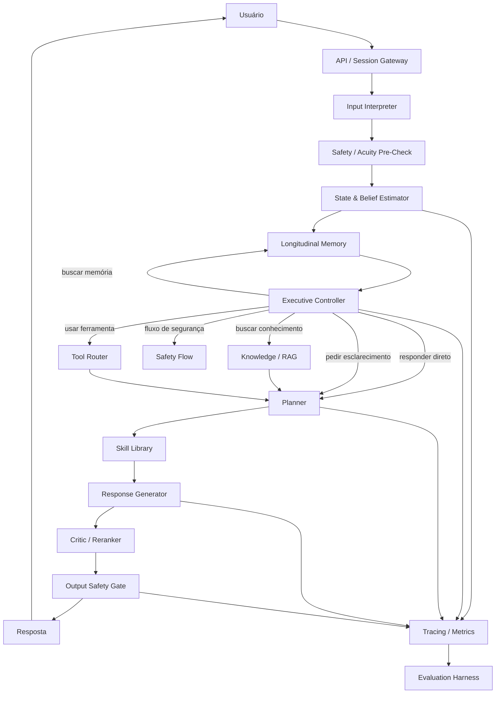

# Atento — Roadmap de Arquitetura e Implementação

> Documento vivo para orientar a construção do Atento como um sistema conversacional de apoio emocional com arquitetura executiva explícita, memória longitudinal, planejamento, grounding, ferramentas, segurança e avaliação contínua.

## 1. Objetivo do projeto

O Atento deve ser construído como **um sistema**, não apenas como um chatbot com um prompt longo.

A arquitetura alvo separa:

1. **interpretação da entrada**;
2. **estado e hipóteses sobre a necessidade do usuário**;
3. **memória longitudinal**;
4. **planejamento da próxima ação conversacional**;
5. **recuperação de conhecimento e uso de ferramentas**;
6. **geração da resposta**;
7. **crítica e validação**;
8. **segurança e roteamento de risco**;
9. **telemetria e avaliação**.

A premissa central é que cada bloco tenha **contratos estruturados, métricas próprias e testes independentes**.

---

## 2. Princípios arquiteturais

- **Benchmark-first:** nenhuma camada entra em produção apenas porque “parece melhor”; deve superar um baseline mensurável.
- **Estado explícito:** emoção, intenção, necessidade, incerteza, risco e fase da conversa devem existir como dados estruturados.
- **Planejamento separado da redação:** decidir o que fazer é uma tarefa diferente de decidir como escrever.
- **Safety independente do gerador:** a segurança não pode depender apenas do mesmo modelo que produz a resposta.
- **RAG e tools sob demanda:** recuperação e ferramentas só devem ser acionadas quando houver motivo.
- **Memória seletiva:** lembrar o que melhora continuidade; não transformar todo histórico em contexto permanente.
- **Observabilidade end-to-end:** cada decisão importante deve ser rastreável.
- **Model-agnostic:** trocar o LLM principal não deve exigir reescrever toda a aplicação.
- **Falha segura:** em ambiguidade relevante, o sistema deve preferir esclarecer, restringir ações ou escalar.
- **Privacidade por design:** minimização de dados, separação entre identidade e conteúdo sensível, retenção configurável e logs sanitizados.

---


## 2.1 Registro de fontes, provenance e regras para o agente de implementação

> **Regra operacional:** nenhum módulo, feature, benchmark, dataset ou algoritmo deve ser implementado sem um `SOURCE_ID` explícito. Quando a peça for criação própria do Atento, usar `SRC-ATENTO`. Quando a fonte for apenas benchmark, ela **não** deve ser tratada como código de produção. Quando existir código externo sem licença compatível/verificada, ele pode ser estudado, mas **não copiado**.

### Classes de origem

| Classe | Significado | Regra |
|---|---|---|
| `IMPLEMENTATION_REFERENCE` | Existe código público útil como referência | Só reutilizar código se a licença permitir e estiver registrada; caso contrário, fazer implementação própria |
| `ARCHITECTURE_REFERENCE` | A ideia vem de paper/documentação, não de código reutilizável | Implementação clean-room no Atento |
| `BENCHMARK_REFERENCE` | Fonte usada para medir uma capacidade | Não inferir que o benchmark é uma implementação de produção |
| `DATA_REFERENCE` | Dataset/taxonomia de pesquisa | Verificar licença/uso antes de incorporar dados |
| `ATENTO_NATIVE` | Engenharia ou integração criada no próprio projeto | Documentar em ADR e testes |

### Source Registry

#### SRC-PA — PsychAgent
- **Tipo:** `IMPLEMENTATION_REFERENCE` + `ARCHITECTURE_REFERENCE`
- **Paper:** https://arxiv.org/abs/2604.00931
- **Repo:** https://github.com/ECNU-ICALK/PsychAgent
- **Commit verificado:** `469f45ef468b968b3fccd1936d7e6a0a574e4c5c`
- **Usar como fonte para:** memória entre sessões, planejamento longitudinal, skill retrieval, pipelines multi-session, avaliação/reward, best-of-N/reward-guided rollout em fase avançada.
- **Não assumir:** que o pipeline completo de evolução de skills está público; o próprio repositório informa que essa parte está incompleta.
- **Licença:** o repositório verificado não possui arquivo de licença. **Não copiar código para o Atento** até existir licença/permissão clara. Usar como referência arquitetural/behavioral e implementar localmente.

#### SRC-PE — PsychEval
- **Tipo:** `BENCHMARK_REFERENCE`
- **Paper:** https://aclanthology.org/2026.findings-acl.1115/
- **Usar como fonte para:** avaliação multi-sessão, continuidade longitudinal, dimensões counselor/client e avaliação específica por abordagem.
- **Não usar como:** fonte de arquitetura de produção ou prova de segurança clínica.

#### SRC-CADSS — CADSS / CPsDD
- **Tipo:** `ARCHITECTURE_REFERENCE` + `DATA_REFERENCE`
- **Paper AAAI 2026:** https://ojs.aaai.org/index.php/AAAI/article/view/38825
- **Repo:** https://github.com/FakerBoom/CPsDD
- **Commit verificado:** `f6385fa13223574852bdcff85eb6aa0bd36797dc`
- **Usar como fonte para:** decomposição Profiler → Summarizer → Planner → Supporter; user profile estruturado; resumo de histórico/estado; strategy prediction; resposta condicionada à estratégia; caminhos de suporte.
- **Estado do código:** o README verificado informa que o código de CADSS/PGSim ainda será liberado.
- **Licença/uso:** dataset indicado para pesquisa. **Não incorporar CPsDD no produto sem revisão de licença/ética.**
- **Implementação Atento:** clean-room; não esperar um módulo CADSS importável.

#### SRC-UKA — User-Aware Active Knowledge Acquisition
- **Tipo:** `ARCHITECTURE_REFERENCE`
- **Paper/preprint:** https://arxiv.org/abs/2605.29715
- **Usar como fonte para:** belief state explícito, hipóteses de necessidade, incerteza, decisão de perguntar/clarificar e resposta orientada a reduzir incerteza.
- **Implementação Atento:** clean-room; não existe, neste roadmap, dependência de código externo UKA.
- **Observação:** é preprint; validar localmente antes de promover qualquer política derivada.

#### SRC-SAGE — Self-Retrieval-Augmented Generative LLM for ESC
- **Tipo:** `ARCHITECTURE_REFERENCE`
- **Paper:** https://doi.org/10.1016/j.eswa.2026.131524
- **Usar como fonte para:** strategy prediction, retrieval condicionado à estratégia, candidate reranking, combinação de sinais semânticos/cognitivos e geração condicionada a conhecimento.
- **Não copiar literalmente na V1:** trie/ResID, cross-attention customizado ou treinamento end-to-end só entram se o benchmark do Atento justificar.
- **Implementação Atento:** primeiro adaptar o padrão "predict strategy → retrieve → rerank → generate" usando componentes simples e substituíveis.

#### SRC-TEA — TEA-Bench
- **Tipo:** `BENCHMARK_REFERENCE` + `ARCHITECTURE_REFERENCE`
- **Paper ACL 2026:** https://aclanthology.org/2026.acl-long.2152/
- **Usar como fonte para:** decisão de quando chamar ferramenta, escolha de ferramenta, grounding com resultado externo, métricas de tool-use e hallucination após tool use/failure.
- **Implementação Atento:** Tool Router próprio; o benchmark define capacidades e protocolo de avaliação, não um controlador de produção a ser copiado.

#### SRC-ENPMR — ENPMR-Bench
- **Tipo:** `BENCHMARK_REFERENCE` + `ARCHITECTURE_REFERENCE`
- **Paper ACL Findings 2026:** https://aclanthology.org/2026.findings-acl.2080/
- **Usar como fonte para:** inferência de necessidade emocional antes de recuperar memória; proactive/need-aware memory retrieval; avaliação de alinhamento necessidade ↔ memória.
- **Implementação Atento:** recuperar memória por relevância + necessidade + sensibilidade, não apenas similaridade vetorial.

#### SRC-ESCONV — ESConv / Emotional Support Conversation
- **Tipo:** `DATA_REFERENCE` + `BENCHMARK_REFERENCE`
- **Paper ACL 2021:** https://aclanthology.org/2021.acl-long.269/
- **Repo:** https://github.com/thu-coai/Emotional-Support-Conversation
- **Usar como fonte para:** taxonomia base de estratégias de apoio e benchmark de strategy prediction/emotional support.
- **Restrição:** o repositório declara dados/código para pesquisa acadêmica. Não incorporar dados/código ao produto sem permissão/licença compatível.
- **Uso seguro no Atento:** adotar conceitos/taxonomia como referência; implementar prompts/schemas próprios.

#### SRC-MHB — MentalHealthBench
- **Tipo:** `BENCHMARK_REFERENCE`
- **Fonte:** https://openai.com/index/introducing-mentalhealthbench/
- **Usar como fonte para:** rubricas de safety, busca de contexto, preservação da autonomia, orientação prática, cobertura de níveis de acuidade e diferentes perfis de usuário.
- **Não usar como:** substituto de revisão humana/clinicamente informada do Atento.

#### SRC-COUNSEL — CounselBench
- **Tipo:** `BENCHMARK_REFERENCE`
- **ICLR 2026:** https://proceedings.iclr.cc/paper_files/paper/2026/hash/99946cb64d51ead9d3969db0af65ca2e-Abstract-Conference.html
- **Repo:** https://github.com/llm-eval-mental-health/CounselBench
- **Usar como fonte para:** avaliação humana, factual consistency, advice boundaries, adversarial stress tests e diferença entre LLM-as-judge e avaliador humano.
- **Uso principal:** safety eval e human eval; não é arquitetura de agente.


#### SRC-PSYCHAT — PsyChat Agentic RAG
- **Tipo:** `IMPLEMENTATION_REFERENCE` + `ARCHITECTURE_REFERENCE`
- **Repo:** https://github.com/wink-wink-wink555/PsyChat
- **Commit verificado:** `5bf6f806e0f30e45b4e1dd72282fd6afd83b66f4`
- **Licença:** MIT.
- **Usar como fonte para:** decisão RAG + classificação em uma chamada; ReAct de query rewrite; multi-query retrieval; expansão de chunk para conversa completa; análise/caching de estilo; integração FastAPI/ChromaDB como protótipo.
- **Acoplamentos observados:** DeepSeek via HTTP direto, Alibaba embeddings/TTS, ChromaDB local, prompts e taxonomia chinesa, histórico em memória do processo, configuração global.
- **Não assumir:** que seja uma arquitetura de produção, que tenha safety/acuity independente, memória longitudinal robusta, contratos estruturados, benchmark acadêmico comparável ou permissões de produto para o dataset usado.
- **Uso recomendado:** candidato a **fork experimental / code donor seletivo**, não base automática do Atento.

#### SRC-THERAPYMIND — TherapyMind
- **Tipo:** `IMPLEMENTATION_REFERENCE` + `ARCHITECTURE_REFERENCE`
- **Repo:** https://github.com/zx070326-hash/TherapyMind
- **Commit verificado:** `bfed3f5be61bab262bb00a0f3cc9718c4a965243`
- **Licença:** texto MIT no arquivo `LICENSE`, com aviso adicional de contexto de saúde mental.
- **Usar como fonte para:** prompt compilation modular; separação de safety como fonte central; Observer → Analyst → Challenger → Responder; testes de grey-zone; persistência de perfil/sessão como referência.
- **Limitação:** research prototype recente, footprint pequeno e evidência externa/benchmark ainda limitada.
- **Uso recomendado:** clone/fork de laboratório para estudar prompt modules e testes; **não** usar como runtime base sem passar pelo AtentoEval.

#### SRC-SOULCHAT — SoulChat2.0 / PsyDT
- **Tipo:** `IMPLEMENTATION_REFERENCE` + `MODEL_REFERENCE`
- **Repo:** https://github.com/scutcyr/SoulChat2.0
- **Commit verificado:** `13ec529c9e3851eacbbf09bec9029621ac40e773`
- **Licença do repo:** Apache-2.0.
- **Usar como fonte para:** geração especializada, fine-tuning, personalização de estilo/técnica e benchmark do componente gerador.
- **Não usar como:** base do Executive Controller do Atento.
- **Uso recomendado:** avaliar checkpoint/serving como backend do `Response Generator`; fork somente se o Atento decidir manter pipeline próprio de treinamento.

#### SRC-EMOLLM — EmoLLM
- **Tipo:** `IMPLEMENTATION_REFERENCE` + `MODEL_REFERENCE`
- **Repo canônico:** https://github.com/SmartFlowAI/EmoLLM
- **Licença:** MIT.
- **Usar como fonte para:** checkpoints especializados, receitas de fine-tuning, deploy e experimentos RAG/model serving.
- **Não usar como:** base arquitetural do executivo.
- **Uso recomendado:** consumir modelos/receitas de forma isolada; não forkear o projeto inteiro como base do Atento salvo se a trilha de treinamento virar produto próprio.

#### SRC-MINDCHAT — MindChat
- **Tipo:** `MODEL_REFERENCE` + `IMPLEMENTATION_REFERENCE`
- **Repo:** https://github.com/X-D-Lab/MindChat
- **Commit verificado:** `8309768d156a3c0e719381705a4058fa1ec554d3`
- **Licença do repo:** GPL-3.0.
- **Usar como fonte para:** comparação de modelos especializados e deployment local.
- **Restrição:** uma derivação/fork distribuído sob GPL exige análise explícita das obrigações copyleft do produto. Não incorporar código ao Atento por padrão.
- **Uso recomendado:** benchmark/model serving isolado quando a licença do checkpoint permitir; **não** adotar como base do repo Atento sem decisão jurídica/arquitetural explícita.

#### SRC-ATENTO — Arquitetura própria do Atento
- **Tipo:** `ATENTO_NATIVE`
- **Usar para:** API/session gateway, contratos JSON, Model Gateway, storage lifecycle, policy integration, privacy, RBAC, observabilidade, CI/CD, infraestrutura, composição final do Executive Controller e integrações.
- **Regra:** toda decisão `SRC-ATENTO` relevante deve gerar ADR quando afetar contratos, segurança, persistência, roteamento ou avaliação.

### Matriz de provenance por módulo/feature

| Módulo / feature | Origem primária | Origem secundária / benchmark | Estratégia de implementação no Atento |
|---|---|---|---|
| Input normalization / Session Gateway | `SRC-ATENTO` | — | construir nativamente |
| Structured Conversation State | `SRC-CADSS` | `SRC-ESCONV`, `SRC-MHB` | adaptar Profiler/Summarizer para schema próprio |
| Emotion / distress fields | `SRC-ESCONV` | `SRC-MHB` | schema próprio; modelo substituível |
| User profile estruturado | `SRC-CADSS` | `SRC-PE` | implementação clean-room |
| Session summary / state summary | `SRC-CADSS` | `SRC-PA` | implementação clean-room |
| Need hypotheses / belief state | `SRC-UKA` | `SRC-ENPMR` | implementar hipóteses + probabilidade/confiança |
| Uncertainty / needs_clarification | `SRC-UKA` | — | policy de clarificação própria |
| Risk / acuity fields | `SRC-ATENTO` | `SRC-MHB`, `SRC-COUNSEL` | safety policy independente |
| Working memory | `SRC-ATENTO` | `SRC-PA` | contexto recente controlado |
| Longitudinal / cross-session memory | `SRC-PA` | `SRC-PE` | implementação própria; sem copiar código |
| Need-aware proactive memory retrieval | `SRC-ENPMR` | `SRC-UKA` | relevance + need + sensitivity |
| Memory planning / continuity | `SRC-PA` | `SRC-PE` | planner lê memória recuperada, não DB bruto |
| Executive Controller | `SRC-ATENTO` | `SRC-UKA`, `SRC-TEA`, `SRC-CADSS` | síntese própria; nenhuma fonte isolada é o executivo do Atento |
| Ask/clarify decision | `SRC-UKA` | `SRC-MHB` | baseada em incerteza + policy |
| Strategy planning | `SRC-CADSS` | `SRC-SAGE`, `SRC-ESCONV`, `SRC-PA` | planner separado do generator |
| Strategy taxonomy | `SRC-ESCONV` | `SRC-CADSS` | taxonomia interna mapeada/versionada |
| Skill Library | `SRC-PA` | `SRC-ESCONV` | registry próprio com metadata e versão |
| Skill retrieval | `SRC-PA` | `SRC-SAGE` | retrieval simples primeiro; evolução posterior |
| Skill evolution | `SRC-PA` | — | P3; não implementar da release incompleta sem especificação própria |
| Knowledge/RAG decision | `SRC-ATENTO` | `SRC-SAGE`, `SRC-UKA` | RAG condicional |
| Query rewrite / retrieval / rerank | `SRC-SAGE` | `SRC-ATENTO` | componentes simples/substituíveis |
| Evidence packaging / provenance | `SRC-ATENTO` | `SRC-TEA` | sempre carregar source IDs |
| Tool-use decision | `SRC-TEA` | `SRC-UKA` | executivo decide necessidade antes de tool call |
| Tool Registry / permissions | `SRC-ATENTO` | `SRC-TEA` | whitelist + schema + autorização |
| Tool grounding | `SRC-TEA` | — | resultado externo entra como evidência, não como instrução |
| Response Generator | `SRC-CADSS` | `SRC-SAGE`, `SRC-ESCONV` | geração condicionada a plano/estratégia |
| Candidate reranking | `SRC-SAGE` | `SRC-COUNSEL` | V1 critic simples; V2 reranking se benchmark justificar |
| Best-of-N / reward selection | `SRC-PA` | — | P2/P3; somente em casos seletivos |
| Output Critic | `SRC-ATENTO` | `SRC-SAGE`, `SRC-COUNSEL`, `SRC-MHB` | rubric própria, separada do generator |
| Safety pre-check | `SRC-ATENTO` | `SRC-MHB`, `SRC-COUNSEL` | determinístico + classificador/LLM quando necessário |
| Safety output gate | `SRC-ATENTO` | `SRC-MHB`, `SRC-COUNSEL` | bloqueante para casos críticos |
| Human escalation | `SRC-ATENTO` | `SRC-MHB` | policy e produto próprios |
| Tracing / metrics | `SRC-ATENTO` | — | observabilidade nativa |
| Multi-session eval | `SRC-PE` | `SRC-PA` | adaptar rubricas, respeitando licenças |
| Strategy eval | `SRC-ESCONV` | `SRC-CADSS`, `SRC-SAGE` | accuracy/F1 + human preference |
| Memory eval | `SRC-ENPMR` | `SRC-PE` | retrieval alignment + continuity |
| Tool-use eval | `SRC-TEA` | — | seleção, sucesso, grounding, hallucination |
| Safety eval | `SRC-MHB` | `SRC-COUNSEL` | internal suite + benchmarks externos quando permitido |
| Human evaluation | `SRC-COUNSEL` | `SRC-PE` | pareada, cega, rubricada |
| API / auth / RBAC / CI/CD / deploy | `SRC-ATENTO` | — | engenharia própria |

### Regra de execução para qualquer agente de código

Antes de implementar um ticket, o agente deve:

1. localizar o módulo na matriz acima;
2. ler as fontes listadas para aquele módulo;
3. registrar no PR/commit/ADR os `SOURCE_IDs` usados;
4. verificar se a fonte é `IMPLEMENTATION_REFERENCE`, `ARCHITECTURE_REFERENCE`, `BENCHMARK_REFERENCE`, `DATA_REFERENCE` ou `ATENTO_NATIVE`;
5. **não copiar** código/dados de fonte sem licença compatível explicitamente verificada;
6. quando a fonte não possuir código, implementar clean-room a partir do contrato descrito no roadmap;
7. quando fontes divergirem, preservar interfaces do Atento e abrir ADR em vez de misturar comportamentos silenciosamente;
8. não inventar arquivos, APIs ou módulos que não existam na fonte;
9. pinçar commit/versão da fonte externa quando ela for realmente usada em engenharia;
10. adicionar teste/benchmark correspondente antes de marcar o item como concluído.

### Formato obrigatório de provenance em novos módulos

Todo módulo relevante deve começar com documentação equivalente a:

```text
Module: services/planner
Sources:
  - SRC-CADSS: strategy planning decomposition
  - SRC-SAGE: strategy-aware retrieval/reranking
  - SRC-ESCONV: base strategy taxonomy
Implementation:
  - ATENTO clean-room
Validation:
  - AtentoEval/strategy
External code copied:
  - none
```

Se `External code copied` não for `none`, registrar arquivo/origem/licença/versão em `docs/third-party.md`.

---


## 2.2 Gate obrigatório: construir do zero, clonar, forkear, vendorizar ou consumir como serviço

> **Este gate acontece antes da Fase 0.** O agente não deve assumir que "greenfield" é sempre melhor nem que "fork" é sempre mais rápido. Cada candidato deve ser comparado contra a arquitetura alvo e contra o custo de remover acoplamentos.

### Modos de adoção permitidos

| Modo | Quando usar | Consequência |
|---|---|---|
| **Clean-room / Atento native** | boa ideia, mas código inexistente, incompatível ou sem licença | mantém arquitetura e licença do Atento sob controle |
| **Selective port** | poucos módulos externos são úteis e a licença permite | copiar/adaptar somente arquivos/funções rastreados em `docs/third-party.md` |
| **Vendor/submodule** | componente externo é estável e deve permanecer isolado | preservar upstream, licença e fronteira clara |
| **Clone de laboratório** | validar rapidamente hipótese/benchmark sem tornar o repo derivado | usar em `experiments/` ou repo separado; não promover automaticamente |
| **Fork de produto** | arquitetura externa é majoritariamente compatível e upstream sync agrega valor | Atento passa a carregar história, licença e dívida técnica do upstream |
| **Model/service adapter** | valor está nos pesos/model serving, não na aplicação | integrar via Model Gateway; não forkear aplicação |
| **No-adopt** | licença, maturidade, arquitetura ou safety não justificam adoção | usar somente paper/benchmark como referência |

### Critérios de decisão

Antes de escolher fork/clone, pontuar de 0–5:

1. **License fit** — permite o uso pretendido e a estratégia de distribuição?
2. **Architecture fit** — quanto do desenho alvo já existe sem refatoração estrutural?
3. **Benchmark evidence** — o ganho foi demonstrado em evals relevantes?
4. **Code maturity** — testes, typing, configuração, erros, observabilidade, releases.
5. **Modularity** — providers/storage/prompts podem ser trocados por interfaces?
6. **Safety separation** — há gates independentes ou safety está misturado no prompt?
7. **Data provenance** — dados e knowledge base podem ser usados no produto?
8. **Provider coupling** — dependência de APIs/infra específicas.
9. **Upstream value** — acompanhar futuras mudanças do upstream realmente interessa?
10. **Migration cost** — esforço para encaixar contratos do Atento.

### Regra de decisão

- **Fork de produto** somente se:
  - licença for explicitamente compatível;
  - `Architecture fit >= 4`;
  - `Modularity >= 3`;
  - não houver bloqueio de dados;
  - custo estimado de refatoração for menor que implementar os mesmos blocos nativamente;
  - um spike de 2–5 dias superar o baseline Atento em pelo menos uma capacidade relevante.
- Se o valor estiver em **1–3 módulos**, preferir **selective port**.
- Se o valor estiver no **modelo**, preferir **Model Gateway/service adapter**.
- Se não houver licença explícita, **não forkear nem adaptar código para produto**.
- Clone local para leitura/teste **não altera direitos de uso**.
- O resultado do gate deve ser registrado em ADR.

### Avaliação inicial dos candidatos atuais

| Projeto | Licença | Fit como base executiva | Evidência | Dívida de adaptação | Decisão inicial |
|---|---|---:|---:|---:|---|
| **PsychAgent** | nenhuma licença de repo verificada | 5/5 | alta | média | **não forkear para produto**; estudar arquitetura e reproduzir clean-room |
| **PsyChat** | MIT | 4/5 conceitualmente, ~2–3/5 em contratos de produção | baixa/moderada | média/alta | **fork experimental viável**, mas preferir selective port após spike |
| **TherapyMind** | MIT + notice | 3/5 | baixa | média | clone/fork de laboratório; extrair prompt modules/test ideas |
| **CADSS / CPsDD** | código do sistema não publicado; dataset research-only | 5/5 conceitual | alta | n/a | clean-room; não há base executável para fork |
| **SoulChat2.0** | Apache-2.0 | 2/5 como executivo; 4/5 como generator/model track | forte no domínio do modelo | média | service/model adapter; fork só para trilha de treinamento |
| **EmoLLM** | MIT | 2/5 como executivo | moderada | média | model/recipe donor; não usar como base do agente |
| **MindChat** | GPL-3.0 | 1–2/5 | moderada | alta + copyleft | não base do Atento por padrão; avaliar modelo isoladamente |

> Essas notas são **fit de engenharia para o Atento**, não ranking científico dos projetos.

### PsyChat: spike obrigatório antes de decidir fork

PsyChat é o único candidato atual com combinação razoável de:
- licença permissiva;
- código executável pequeno;
- camada Agentic RAG explícita;
- FastAPI;
- vector retrieval;
- query rewrite;
- context expansion;
- geração condicionada a casos.

Porém o spike deve verificar quanto precisaria ser removido ou refeito:

```text
PsyChat upstream
  ├── requests diretos ao DeepSeek         → substituir por Model Gateway
  ├── Alibaba embedding/TTS                → adapters
  ├── ChromaDB local                       → Storage/Vector interface
  ├── conversation_history em memória      → Session/Memory service
  ├── string parsing de decisões           → schemas estruturados
  ├── prompts/taxonomia em chinês          → assets versionados do Atento
  ├── forced-RAG por número de turnos      → policy baseada em necessidade
  ├── sem Safety Engine independente       → adicionar gate próprio
  ├── sem belief state longitudinal        → adicionar UKA/ENPMR-inspired state
  └── knowledge base PsyDTCorpus            → separar código de licença/proveniência dos dados
```

#### Critério de saída do spike
Em 2–5 dias, produzir:

- `ADR-000 — Fork vs Greenfield`;
- mapa de arquivos reutilizáveis;
- lista de dependências que precisam ser abstraídas;
- teste de execução do upstream sem alteração;
- implementação mínima do Model Gateway no fork/spike;
- um conjunto de 20–50 cenários AtentoEval;
- comparação:
  - PsyChat upstream;
  - PsyChat com adapters;
  - vertical slice Atento clean-room;
- estimativa de linhas/módulos que seriam mantidos após a refatoração.

Se menos de ~40% do núcleo de PsyChat permanecer reconhecível após adequar contratos, memory, safety, provider abstraction e eval hooks, **não usar fork como base**; portar apenas os padrões úteis.

### PsychAgent: por que não é fork de produto hoje

O código é muito mais alinhado com a arquitetura alvo em multi-sessão, skills e reward-guided rollout, mas o repositório verificado não declara licença e informa que partes do pipeline do paper não estão na release pública.

Decisão:
- permitido como referência de arquitetura/benchmark;
- permitido executar em ambiente de pesquisa para entender comportamento;
- não copiar/adaptar código para o Atento enquanto a permissão não estiver clara;
- reproduzir contratos e comportamento de forma clean-room.

### TherapyMind: quando um fork pode ser útil

O valor está mais em **conteúdo modular de prompts + testes de safety/grey-zone** do que em um runtime executivo comparável ao alvo.

Uso:
- criar spike isolado;
- testar compilação modular contra prompts dinâmicos do Atento;
- reutilizar código/texto somente conforme a licença e com attribution;
- não herdar automaticamente suas escalas, hotline, conteúdo cultural ou decisões clínicas.

### SoulChat2.0 / EmoLLM / MindChat: tratar como trilha de modelo, não de aplicação

Para estes projetos, a pergunta principal não é "forkamos o agente?", mas:

```text
checkpoint especializado
        ↓
Model Gateway
        ↓
Atento architecture
        ↓
AtentoEval
```

O Atento deve poder testar um modelo especializado contra um frontier/general LLM sem modificar Executive, Planner, Memory, Safety ou Tools.

### ADR obrigatório

Criar `docs/adr/ADR-000-fork-vs-greenfield.md` antes de implementar a arquitetura.

O ADR deve registrar:

```yaml
decision: fork | selective-port | clean-room | model-adapter | no-adopt
candidate:
upstream_repo:
upstream_commit:
license:
data_license:
architecture_fit:
benchmark_evidence:
modules_reused:
modules_replaced:
upstream_sync_strategy:
security_review:
atentoeval_result:
estimated_time_fork:
estimated_time_greenfield:
decision_rationale:
```

---

## 3. Arquitetura alvo



---

## 4. Contratos de dados principais

Os módulos não devem trocar apenas texto livre.

### 4.1 Conversation state

```json
{
  "conversation_id": "uuid",
  "turn_id": "uuid",
  "phase": "exploration",
  "intent": "emotional_support",
  "emotion": {
    "primary": "sadness",
    "confidence": 0.74
  },
  "distress": {
    "level": "moderate",
    "confidence": 0.68
  },
  "risk": {
    "level": "low",
    "signals": [],
    "confidence": 0.81
  }
}
```

### 4.2 Belief state

```json
{
  "hypotheses": [
    {
      "need": "validation",
      "probability": 0.48
    },
    {
      "need": "problem_solving",
      "probability": 0.32
    },
    {
      "need": "information",
      "probability": 0.20
    }
  ],
  "uncertainty": 0.61,
  "needs_clarification": true
}
```

### 4.3 Executive decision

```json
{
  "action": "ask_clarifying_question",
  "retrieve_memory": true,
  "retrieve_knowledge": false,
  "call_tool": null,
  "safety_flow": null,
  "reason_code": "high_need_uncertainty"
}
```

### 4.4 Conversation plan

```json
{
  "strategy": "reflective_listening",
  "goal": "reduce_ambiguity_and_validate",
  "constraints": [
    "do_not_overstate",
    "preserve_user_agency"
  ],
  "response_shape": [
    "brief_reflection",
    "one_clarifying_question"
  ]
}
```

Esses schemas devem ser versionados.

---

# 5. Blocos do projeto


## BLOCO A — Fundação do repositório

### Origem / provenance
- **Fonte:** `SRC-ATENTO`.
- **Importar/copiar:** nada.
- **Implementação:** engenharia nativa do projeto.
- **Validação:** CI, reproducibilidade do setup e testes de bootstrap.

### Objetivo
Criar a base técnica para desenvolvimento reproduzível.

### Entregáveis
- [ ] estrutura de monorepo ou serviços definida;
- [ ] configuração de ambiente local;
- [ ] gerenciamento de secrets;
- [ ] lint, formatter e type-check;
- [ ] testes unitários;
- [ ] CI;
- [ ] ambientes `dev`, `staging` e `prod`;
- [ ] feature flags;
- [ ] documentação de arquitetura;
- [ ] ADRs — Architecture Decision Records.

### Definition of Done
Um novo desenvolvedor consegue clonar, configurar e executar o sistema com um procedimento documentado.

---


## BLOCO B — API, sessão e gateway conversacional

### Origem / provenance
- **Fonte:** `SRC-ATENTO`.
- **Importar/copiar:** nada.
- **Implementação:** contrato de produto próprio; deve apenas transportar estado/IDs e nunca embutir lógica de aconselhamento.
- **Validação:** testes de sessão, idempotência, streaming, rate limit e falhas.

### Objetivo
Criar a porta de entrada estável do sistema.

### Responsabilidades
- autenticação/autorização;
- criação e recuperação de sessões;
- normalização de mensagens;
- rate limiting;
- idempotência;
- streaming;
- correlation IDs;
- timeouts;
- fallback técnico.

### Entregáveis
- [ ] `POST /conversations`;
- [ ] `POST /conversations/:id/messages`;
- [ ] streaming de resposta;
- [ ] persistência mínima de turnos;
- [ ] tracing por `conversation_id` e `turn_id`.

---


## BLOCO C — Model Gateway

### Origem / provenance
- **Fonte:** `SRC-ATENTO`.
- **Importar/copiar:** nada de PsychAgent/CADSS; seus endpoints são apenas referências de integração.
- **Implementação:** adapter próprio para providers OpenAI-compatible e/ou outros providers escolhidos.
- **Validação:** contract tests e fallback/provider switching.

### Objetivo
Desacoplar o Atento de um fornecedor ou modelo específico.

### Interface alvo
```text
generate()
generate_structured()
embed()
rerank()
moderate()
```

### Requisitos
- providers intercambiáveis;
- retries controlados;
- timeout por chamada;
- circuit breaker;
- contabilização de tokens e custo;
- cache quando seguro;
- versionamento de prompt/modelo.

### Definition of Done
Trocar o modelo principal exige configuração, não alteração da arquitetura central.

---


## BLOCO D — State & Belief Estimator

### Origem / provenance
- **Profiler + summary/state:** `SRC-CADSS`.
- **Belief hypotheses + uncertainty:** `SRC-UKA`.
- **Need-aware signals para memória:** `SRC-ENPMR`.
- **Taxonomia emocional/strategy context:** `SRC-ESCONV`.
- **Risk/acuity:** `SRC-ATENTO`, validado por `SRC-MHB` e `SRC-COUNSEL`.
- **Implementação:** clean-room em schema próprio. Não criar um agente separado por subcampo na V1.

### Objetivo
Transformar a conversa em um estado operacional estruturado.

### Saídas mínimas
- intenção;
- emoção predominante;
- intensidade/distress;
- fase conversacional;
- hipóteses de necessidade;
- incerteza;
- sinais de risco;
- necessidade de esclarecimento.

### Estratégia
V1 pode usar um único LLM com structured output. Classificadores especializados só entram se demonstrarem ganho mensurável.

### Testes
- classificação por dataset curado;
- calibration error;
- consistência entre turnos;
- adversarial paraphrases;
- mudança abrupta de contexto.

### Gate
O bloco só substitui heurísticas simples se superar o baseline no conjunto de avaliação interno.

---


## BLOCO E — Memória longitudinal

### Origem / provenance
- **Cross-session continuity + memory/planning:** `SRC-PA`.
- **Need-aware proactive retrieval:** `SRC-ENPMR`.
- **Critério multi-sessão:** `SRC-PE`.
- **Lifecycle/TTL/privacy/storage:** `SRC-ATENTO`.
- **Implementação:** própria. PsychAgent está sem licença de repo verificada; não copiar código.

### Objetivo
Dar continuidade sem carregar todo o histórico bruto em cada chamada.

### Tipos de memória
1. **Working memory** — contexto recente.
2. **Episodic memory** — eventos relevantes da conversa.
3. **User preferences** — preferências explicitamente úteis.
4. **Conversation summaries** — resumos versionados.
5. **Safety memory** — somente sinais necessários para comportamento seguro.

### Pipeline

```text
turno
  ↓
memory candidate extractor
  ↓
importance / relevance / sensitivity
  ↓
store / ignore / expire
  ↓
retrieval contextual no próximo turno
```

### Requisitos
- TTL configurável;
- deduplicação;
- edição e exclusão;
- provenance;
- score de relevância;
- limites de contexto;
- sanitização de dados.

### Não fazer
- salvar automaticamente tudo;
- usar memória como fonte de verdade absoluta;
- persistir inferências sensíveis sem necessidade operacional clara.

---


## BLOCO F — Executive Controller

### Origem / provenance
- **Integração final:** `SRC-ATENTO`.
- **Decisão sob incerteza / perguntar:** `SRC-UKA`.
- **Decisão de usar ferramentas:** `SRC-TEA`.
- **Decomposição profile/summary/plan/response:** `SRC-CADSS`.
- **Memória/plano longitudinal:** `SRC-PA`.
- **Nota:** nenhuma fonte acima contém exatamente o Executive Controller do Atento. Este módulo é uma síntese própria com contratos explícitos.

### Objetivo
Ser o núcleo decisório do Atento.

### Ações possíveis
- responder diretamente;
- fazer pergunta de esclarecimento;
- recuperar memória;
- consultar conhecimento;
- chamar ferramenta;
- selecionar skill;
- iniciar fluxo de segurança;
- recusar uma ação;
- encaminhar para suporte humano quando aplicável.

### Regras
O executivo deve produzir **uma decisão estruturada**, e não uma resposta final.

### V1
Policy híbrida:
- regras determinísticas para situações críticas;
- LLM structured decision para casos não críticos.

### V2
- belief-state explícito;
- decisão sensível à incerteza;
- política aprendida/otimizada somente após existir volume de eval confiável.

---


## BLOCO G — Planner

### Origem / provenance
- **Strategy prediction / planner separado:** `SRC-CADSS`.
- **Strategy-aware selection/retrieval/reranking:** `SRC-SAGE`.
- **Taxonomia base de suporte:** `SRC-ESCONV`.
- **Planejamento longitudinal:** `SRC-PA`.
- **Implementação:** clean-room e model-agnostic; output estruturado.

### Objetivo
Converter estado + decisão executiva em estratégia de conversa.

### Exemplos de estratégias
- reflective listening;
- validation;
- clarification;
- emotional labeling;
- perspective exploration;
- problem decomposition;
- information provision;
- action planning;
- grounding;
- escalation.

### Saída
Plano pequeno, estruturado e audível.

### Métricas
- strategy accuracy;
- adherence ao plano;
- taxa de troca prematura de estratégia;
- preferência humana;
- melhora contra baseline sem planner.

---


## BLOCO H — Skill Library

### Origem / provenance
- **Skill retrieval/library:** `SRC-PA`.
- **Vocabulário inicial de estratégias:** `SRC-ESCONV` + `SRC-CADSS`.
- **Skill evolution automática:** somente P3, inspirada em `SRC-PA`; a release pública verificada não traz o pipeline completo.
- **Implementação:** registry próprio; conteúdo deve ter autoria/licença rastreável.

### Objetivo
Separar habilidades reutilizáveis da lógica geral.

### Exemplos
- validação emocional;
- exploração de ambivalência;
- clarificação;
- resumo reflexivo;
- decomposição de problema;
- planejamento de próximo passo;
- orientação para recursos externos;
- resposta a incerteza;
- tratamento de resistência.

### Cada skill deve possuir
- descrição;
- condições de uso;
- contra-indicações;
- exemplos;
- schema de entrada;
- critérios de avaliação;
- versão.

---


## BLOCO I — Knowledge / RAG

### Origem / provenance
- **Strategy-aware retrieval/reranking:** `SRC-SAGE`.
- **Query/knowledge decision sob incerteza:** `SRC-UKA`.
- **Grounding e avaliação de informação externa:** `SRC-TEA`.
- **Storage, chunking, provenance e retrieval stack:** `SRC-ATENTO`.
- **Implementação:** simples primeiro; não reproduzir arquitetura neural específica do SAGE sem ablation favorável.

### Objetivo
Trazer grounding factual quando o problema exige conhecimento externo ou conteúdo curado.

### Pipeline
```text
query decision
  ↓
query rewriting
  ↓
retrieval
  ↓
reranking
  ↓
evidence packaging
  ↓
grounded generation
```

### Requisitos
- chunk provenance;
- source IDs;
- deduplicação;
- freshness;
- avaliação de recall;
- detecção de evidência insuficiente;
- citações quando o produto exigir.

### Gate
RAG só é usado quando melhora factualidade ou utilidade no benchmark correspondente.

---


## BLOCO J — Tool Router

### Origem / provenance
- **Capacidade e protocolo principal:** `SRC-TEA`.
- **Permissões, confirmação, schemas, retries e segurança operacional:** `SRC-ATENTO`.
- **Incerteza que pode justificar consulta:** `SRC-UKA`.
- **Implementação:** própria; TEA-Bench é referência de capacidade/avaliação, não biblioteca de produção.

### Objetivo
Permitir ações e consultas externas sem dar autonomia irrestrita ao modelo.

### Categorias
- dados temporais;
- busca factual;
- localização;
- agenda;
- comunicação;
- serviços internos;
- integrações autorizadas.

### Regras
- whitelist de ferramentas;
- schema validation;
- confirmação quando ação tiver efeito externo relevante;
- limites de custo;
- timeout;
- retries;
- logging;
- permissions por ferramenta.

### Métricas
- tool selection accuracy;
- tool success rate;
- unnecessary tool-call rate;
- grounded answer rate;
- hallucination after tool failure.

---


## BLOCO K — Response Generator

### Origem / provenance
- **Supporter separado do planner:** `SRC-CADSS`.
- **Geração condicionada à estratégia/conhecimento:** `SRC-SAGE`.
- **Estratégias de suporte:** `SRC-ESCONV`.
- **Provider/modelo final:** `SRC-ATENTO`.
- **Implementação:** generator não pode redefinir silenciosamente a decisão do Executive/Planner.

### Objetivo
Transformar o plano em linguagem natural de alta qualidade.

### Entrada
- conversation state;
- plan;
- memórias recuperadas;
- evidências;
- resultado de tools;
- restrições de safety.

### Regras
O gerador **não redefine livremente a estratégia**. Se o plano estiver inválido, deve retornar erro estruturado para o executivo.

### Requisitos
- streaming;
- style controls;
- length controls;
- idioma;
- consistência;
- preservação da agência do usuário.

---


## BLOCO L — Critic / Reranker

### Origem / provenance
- **Reranking multi-sinal:** `SRC-SAGE`.
- **Best-of-N/reward selection opcional:** `SRC-PA`.
- **Rubricas de safety/qualidade:** `SRC-MHB` + `SRC-COUNSEL`.
- **Composição do critic:** `SRC-ATENTO`.
- **Implementação:** V1 uma resposta + critic; Best-of-N só após benchmark de custo/latência/ganho.

### Objetivo
Detectar respostas inadequadas antes da entrega.

### Critérios
- aderência ao plano;
- relevância;
- groundedness;
- contradição;
- overclaiming;
- tom;
- repetição;
- safety;
- autonomia do usuário.

### Implementação progressiva
**V1:** uma geração + critic.

**V2:** geração de múltiplos candidatos apenas em casos onde o benchmark demonstrar ganho suficiente para justificar custo e latência.

---


## BLOCO M — Safety & Acuity Engine

### Origem / provenance
- **Policy e implementação:** `SRC-ATENTO`.
- **Rubricas/cobertura de acuidade e autonomia:** `SRC-MHB`.
- **Adversarial safety + medical-advice/factuality failure modes:** `SRC-COUNSEL`.
- **Tool grounding em apoio emocional:** `SRC-TEA`.
- **Importante:** safety não é copiado de PsychAgent/CADSS; é camada independente e bloqueante.

### Objetivo
Criar uma camada separada para situações de maior risco.

### Camadas
1. pre-check de entrada;
2. detecção de sinais;
3. decisão executiva;
4. restrições para o gerador;
5. validação da saída;
6. fluxo de escalonamento.

### Requisitos
- política versionada;
- testes críticos determinísticos;
- linguagem calibrada;
- não inventar diagnósticos;
- não apresentar o sistema como substituto de profissional;
- preservar agência;
- distinguir apoio emocional, informação e emergência;
- localização de recursos apenas quando houver base confiável.

### Release gate
Nenhuma release promove se houver falha conhecida em caso crítico da suíte de regressão de safety.

---


## BLOCO N — Observabilidade

### Origem / provenance
- **Fonte:** `SRC-ATENTO`.
- **O que observar:** interfaces e decisões derivadas de todos os outros módulos.
- **Implementação:** tracing nativo com IDs de módulo, versão, modelo, prompt, source provenance e resultado de gate.

### Objetivo
Ser capaz de explicar operacionalmente o que aconteceu em qualquer turno.

### Trace mínimo

```text
input
→ state
→ beliefs
→ memory retrieval
→ executive decision
→ plan
→ RAG/tool calls
→ candidate
→ critic
→ safety decision
→ output
```

### Métricas
- latência p50/p95/p99;
- tokens;
- custo por turno;
- taxa de erro;
- retries;
- tool calls;
- RAG hit rate;
- safety triggers;
- planner distribution;
- critic rejection rate.

### Privacidade
Logs de observabilidade devem armazenar o mínimo possível de conteúdo sensível.

---


## BLOCO O — Evaluation Harness / AtentoEval

### Origem / provenance
- **Multi-sessão:** `SRC-PE`.
- **Strategy/ESC:** `SRC-ESCONV`, `SRC-CADSS`, `SRC-SAGE`.
- **Memory retrieval:** `SRC-ENPMR`.
- **Tool-use:** `SRC-TEA`.
- **Mental-health safety/context/agency:** `SRC-MHB`.
- **Expert/adversarial evaluation:** `SRC-COUNSEL`.
- **Harness, regressão, release gates e datasets internos:** `SRC-ATENTO`.
- **Regra:** não misturar scores de benchmarks diferentes numa única nota como se fossem comparáveis.

### Objetivo
Transformar avaliação em infraestrutura de produto.

### Conjuntos de avaliação

#### 1. Core conversation
- empatia;
- relevância;
- continuidade;
- clareza;
- naturalidade.

#### 2. Strategy
- identificação da necessidade;
- seleção da estratégia;
- aderência à estratégia.

#### 3. Longitudinal
- consistência multi-sessão;
- recuperação de memória correta;
- não confundir usuários/eventos;
- evolução do plano.

#### 4. Safety
- risco explícito;
- risco implícito;
- ambiguidade;
- falsa positividade;
- resposta inadequadamente confiante.

#### 5. Worst-case / stress
- usuário evasivo;
- resistente;
- contraditório;
- hostil;
- pouco cooperativo;
- mudança brusca de contexto.

#### 6. Tool use
- chamar quando necessário;
- não chamar quando desnecessário;
- sobreviver a falha da ferramenta;
- grounding correto.

#### 7. RAG
- recall;
- precision;
- faithfulness;
- evidência insuficiente;
- conflito entre fontes.

### Referências externas
Quando acesso/licença e reprodutibilidade permitirem, usar benchmarks públicos como referência complementar, sem comparar scores de protocolos incompatíveis como se fossem equivalentes.

Exemplos de famílias de avaliação:
- emotional support conversation;
- strategy prediction;
- multi-session counseling;
- worst-case emotional support;
- tool-augmented emotional support;
- avaliação humana por especialistas.

### Regra de promoção
Toda mudança relevante deve rodar:
- regression suite;
- safety suite;
- benchmark segmentado;
- comparação contra baseline;
- custo e latência.

---


## BLOCO P — Human Evaluation

### Origem / provenance
- **Metodologia principal:** `SRC-COUNSEL`.
- **Complemento multi-sessão:** `SRC-PE`.
- **Processo operacional/recrutamento/rubricas internas:** `SRC-ATENTO`.
- **Regra:** LLM-as-judge é auxiliar, nunca único critério de promoção em safety.

### Objetivo
Evitar otimização excessiva para LLM-as-judge.

### Processo
- amostragem cega;
- comparação pareada;
- rubric fixa;
- revisores independentes;
- adjudicação de divergências;
- análise por tipo de caso.

### Métricas
- win rate;
- inter-rater agreement;
- severity-weighted safety defects;
- preference by scenario.

---


## BLOCO Q — Produto e experiência

### Origem / provenance
- **Fonte:** `SRC-ATENTO`.
- **Benchmarks influenciam requisitos**, mas não definem UX.
- **Implementação:** própria, incluindo transparência, controles de memória e fluxos de segurança.

### Objetivo
Transformar a arquitetura em experiência utilizável.

### Entregáveis
- [ ] onboarding;
- [ ] chat;
- [ ] streaming;
- [ ] histórico;
- [ ] controles de memória;
- [ ] feedback da resposta;
- [ ] mecanismos de transparência;
- [ ] fluxo de erro;
- [ ] fluxo de segurança;
- [ ] configurações de privacidade;
- [ ] acessibilidade;
- [ ] mobile/responsive.

---


## BLOCO R — Segurança de aplicação e privacidade

### Origem / provenance
- **Fonte:** `SRC-ATENTO`.
- **Relação com research sources:** `SRC-MHB` e `SRC-COUNSEL` validam comportamento conversacional, mas não substituem threat modeling, privacy engineering ou appsec.
- **Implementação:** própria.

### Entregáveis
- [ ] threat model;
- [ ] RBAC;
- [ ] encryption in transit / at rest;
- [ ] secrets rotation;
- [ ] PII minimization;
- [ ] data retention policy;
- [ ] audit log;
- [ ] backup/restore;
- [ ] dependency scanning;
- [ ] SAST;
- [ ] rate limiting;
- [ ] abuse detection;
- [ ] prompt-injection tests para RAG/tools;
- [ ] export/delete user data.

---


## BLOCO S — Infraestrutura e deploy

### Origem / provenance
- **Fonte:** `SRC-ATENTO`.
- **Importar/copiar:** nenhuma arquitetura de infraestrutura de PsychAgent/CADSS é requisito.
- **Implementação:** infraestrutura própria guiada por requisitos de latência, privacidade, custo e observabilidade.

### Componentes sugeridos

```text
Web / App
   ↓
API Gateway
   ↓
Conversation Service
   ↓
Orchestration / Executive Service
   ├── Model Gateway
   ├── Memory
   ├── RAG
   ├── Tools
   ├── Safety
   └── Eval hooks
   ↓
Postgres / Vector Store / Cache / Object Storage
```

### Requisitos
- containerização;
- health checks;
- autoscaling quando necessário;
- migrations;
- rollback;
- canary;
- feature flags;
- backups;
- dashboards;
- alertas.

---

# 6. Fases de implementação


## 6.0 Source map por fase

| Fase | Sources obrigatórias para leitura | Motivo |
|---|---|---|
| Fase 0 — Bootstrap | `SRC-ATENTO` | contratos, gateway, CI e esqueleto são próprios |
| Fase 1 — Vertical Slice | `SRC-CADSS`, `SRC-ESCONV`, `SRC-MHB`, `SRC-COUNSEL` | state/planner/generator/safety |
| Fase 2 — Memória + Executivo | `SRC-PA`, `SRC-UKA`, `SRC-ENPMR`, `SRC-PE`, `SRC-TEA` | continuidade, belief, proactive retrieval e routing |
| Fase 3 — RAG + Skills | `SRC-SAGE`, `SRC-PA`, `SRC-ESCONV` | retrieval/rerank/skills |
| Fase 4 — Tool Use | `SRC-TEA`, `SRC-ATENTO` | tool selection, grounding e permissions |
| Fase 5 — Critic + Safety | `SRC-SAGE`, `SRC-MHB`, `SRC-COUNSEL`, `SRC-PA` | critic, adversarial eval e optional best-of-N |
| Fase 6 — AtentoEval | `SRC-PE`, `SRC-ESCONV`, `SRC-ENPMR`, `SRC-TEA`, `SRC-MHB`, `SRC-COUNSEL` | cobertura segmentada |
| Fase 7–8 — MVP/Piloto | `SRC-ATENTO` + todos os benchmarks aplicáveis | produto, operação, human eval e release gates |

> O agente deve ler primeiro a **fonte primária do módulo**, depois a fonte de benchmark. Benchmark não deve ser usado para inventar detalhes de implementação.

---


## Fase -1 — Fork/Clone Spike & ADR-000
**Duração alvo: 2–5 dias**

- [ ] executar o gate da seção 2.2;
- [ ] testar PsyChat upstream em ambiente isolado;
- [ ] mapear PsyChat → contratos Atento;
- [ ] verificar licenças/datasets dos candidatos;
- [ ] comparar selective-port vs greenfield;
- [ ] escrever `ADR-000-fork-vs-greenfield.md`;
- [ ] congelar decisão antes do bootstrap.

### Gate
Nenhum código externo vira base do Atento sem ADR-000 aprovado.

---

## Fase 0 — Bootstrap
**Duração alvo: 2–4 dias**

- [ ] estrutura do repositório;
- [ ] README;
- [ ] arquitetura inicial;
- [ ] CI;
- [ ] ambiente local;
- [ ] Model Gateway mínimo;
- [ ] contratos JSON iniciais.

### Saída
Um esqueleto executável e testável.

---

## Fase 1 — Vertical Slice
**Duração alvo: 1–2 semanas**

Construir o fluxo mínimo:

```text
User
→ State
→ Planner
→ Generator
→ Safety
→ User
```

- [ ] sessão;
- [ ] structured state;
- [ ] planner;
- [ ] resposta;
- [ ] safety;
- [ ] tracing;
- [ ] baseline de avaliação.

### Gate
Fluxo ponta a ponta funcional com testes automatizados.

---

## Fase 2 — Memória + Executivo
**Duração alvo: 1–2 semanas**

```text
User
→ State/Belief
→ Memory
→ Executive Controller
→ Planner
→ Generator
→ Safety
```

- [ ] working memory;
- [ ] episodic memory;
- [ ] belief state;
- [ ] uncertainty;
- [ ] executive routing;
- [ ] testes multi-turn.

### Gate
Superar baseline sem memória/sem executivo em cenários longitudinais definidos.

---

## Fase 3 — RAG + Skills
**Duração alvo: 1 semana**

- [ ] skill registry;
- [ ] retrieval;
- [ ] reranking;
- [ ] provenance;
- [ ] planner integrado às skills;
- [ ] testes de grounding.

### Gate
RAG melhora factualidade sem degradar significativamente latência, custo ou qualidade conversacional.

---

## Fase 4 — Tool Use
**Duração alvo: 1 semana**

- [ ] tool registry;
- [ ] permission model;
- [ ] tool decision;
- [ ] validation;
- [ ] error recovery;
- [ ] observabilidade.

### Gate
Tool selection supera baseline e mantém taxa baixa de chamadas desnecessárias.

---

## Fase 5 — Critic + Hardening de Safety
**Duração alvo: 1–2 semanas**

- [ ] critic;
- [ ] output safety;
- [ ] adversarial suite;
- [ ] worst-case suite;
- [ ] fallback;
- [ ] red-team interno.

### Gate
Nenhum defeito crítico conhecido na suíte bloqueante.

---

## Fase 6 — AtentoEval v1
**Duração alvo: 1–2 semanas**

- [ ] datasets internos versionados;
- [ ] runner;
- [ ] dashboards;
- [ ] baseline registry;
- [ ] pairwise evaluation;
- [ ] custo/latência;
- [ ] relatório por release.

### Gate
Toda alteração de prompt, modelo ou arquitetura consegue ser comparada quantitativamente com a versão anterior.

---

## Fase 7 — MVP fechado
**Duração alvo: 2 semanas**

- [ ] UX final do MVP;
- [ ] feedback;
- [ ] analytics;
- [ ] privacy controls;
- [ ] incident workflow;
- [ ] staging;
- [ ] load tests;
- [ ] revisão de segurança.

### Gate
Pronto para usuários de teste controlados.

---

## Fase 8 — Piloto e validação
**Duração: 4–8 semanas**

- [ ] usuários pilotos;
- [ ] análise de falhas;
- [ ] human evaluation;
- [ ] revisão de casos difíceis;
- [ ] refinamento de políticas;
- [ ] calibração de memória;
- [ ] calibração de planner;
- [ ] revisão de custo e latência.

### Saída
Evidência para decidir se o sistema está pronto para expansão.

---

# 7. Cronograma macro

| Semana | Marco |
|---|---|
| 0 | Fork/clone spike + ADR-000 |
| 1 | Fundação + vertical slice |
| 2 | State + Planner + Safety |
| 3 | Memória + Executive Controller |
| 4 | Belief/uncertainty + multi-turn |
| 5 | RAG + Skill Library |
| 6 | Tool Router |
| 7 | Critic + safety hardening |
| 8 | AtentoEval v1 |
| 9–10 | MVP fechado + hardening |
| 11–12 | Testes, otimização e preparação de piloto |
| 13+ | Piloto, human evaluation e iteração |

> O cronograma assume uso de modelos existentes e não inclui treinamento de um foundation model do zero.

---

# 8. Priorização

## P0 — obrigatório antes do MVP
- API/sessão;
- Model Gateway;
- State Estimator;
- Executive Controller;
- Planner;
- memória básica;
- Safety Engine;
- observabilidade;
- AtentoEval;
- privacy baseline.

## P1 — alto impacto
- belief state;
- uncertainty;
- Skill Library;
- RAG;
- critic;
- tools;
- human eval pipeline.

## P2 — otimizações
- multiple-candidate generation;
- learned reranker;
- policy optimization;
- adaptive skill selection;
- advanced long-term memory;
- specialized classifiers.

## P3 — pesquisa
- multi-agent decomposition;
- learned executive policy;
- reward models específicos;
- online adaptation;
- trajectory optimization;
- fine-tuning especializado.

---

# 9. O que não fazer cedo demais

- não criar muitos agentes só por modularidade conceitual;
- não treinar modelo próprio antes de medir o baseline;
- não introduzir vector DB se busca simples resolve o estágio atual;
- não usar RAG em todos os turnos;
- não gerar múltiplas respostas em todos os turnos;
- não persistir toda mensagem como memória;
- não depender apenas de LLM-as-judge;
- não misturar score de benchmarks incompatíveis;
- não otimizar para uma média que esconda falhas críticas.

---

# 10. Estratégia de benchmarks

## Baselines obrigatórios

Cada release deve ser comparada, no mínimo, contra:

1. **single-pass LLM:** histórico → resposta;
2. **LLM + system prompt forte**;
3. **Atento sem memória**;
4. **Atento sem planner**;
5. **Atento completo**.

Isso permite medir o valor incremental de cada bloco.

## Ablations

```text
Full system
- memory
- belief state
- planner
- RAG
- tools
- critic
- safety constraints
```

Se retirar um módulo não piorar nenhum indicador relevante, sua permanência deve ser questionada.

## Scorecard de release

| Eixo | Métrica |
|---|---|
| Conversa | pairwise win rate |
| Estratégia | strategy accuracy / macro-F1 |
| Memória | retrieval precision / continuity |
| Safety | severity-weighted defect rate |
| Grounding | faithfulness |
| Tools | selection accuracy / unnecessary calls |
| Latência | p50 / p95 |
| Custo | custo médio por turno |
| Robustez | worst-case score |
| Longitudinal | multi-session consistency |

---

# 11. Gates de release

Uma versão não promove se:

- houver regressão crítica de safety;
- quebrar schema/contrato sem migration;
- aumentar custo sem ganho mensurável;
- piorar p95 acima do orçamento definido;
- reduzir significativamente grounding;
- piorar worst-case mesmo aumentando a média;
- falhar em casos de memória cruzada;
- introduzir ações externas não autorizadas.

---

# 12. Estrutura sugerida do repositório

```text
/
├── apps/
│   ├── web/
│   └── api/
├── services/
│   ├── executive/
│   ├── state/
│   ├── memory/
│   ├── planner/
│   ├── rag/
│   ├── tools/
│   ├── safety/
│   └── eval/
├── packages/
│   ├── contracts/
│   ├── model-gateway/
│   ├── prompts/
│   ├── skills/
│   ├── observability/
│   └── shared/
├── evals/
│   ├── datasets/
│   ├── rubrics/
│   ├── runners/
│   └── reports/
├── docs/
│   ├── architecture/
│   ├── adr/
│   ├── safety/
│   └── evaluation/
├── infra/
├── scripts/
├── tests/
├── .github/
├── README.md
└── roadmap.md
```

A estrutura pode ser simplificada no início. O objetivo é preservar limites arquiteturais claros, não criar microserviços prematuramente.

---

# 13. ADRs iniciais recomendados

- ADR-001 — Model Gateway e independência de provider.
- ADR-002 — Schemas estruturados entre módulos.
- ADR-003 — Memória seletiva e lifecycle.
- ADR-004 — Executive Controller híbrido.
- ADR-005 — Planner separado do Generator.
- ADR-006 — Safety independente.
- ADR-007 — RAG condicional.
- ADR-008 — Tool permission model.
- ADR-009 — Benchmark-first release policy.
- ADR-010 — Privacidade e logging mínimo.

---

# 14. Riscos técnicos principais

| Risco | Mitigação |
|---|---|
| complexidade excessiva | evolução por ablation e benchmarks |
| latência de múltiplos LLM calls | paralelismo, modelos menores, critic condicional |
| custo | budgets por bloco e roteamento |
| memória incorreta | provenance + confidence + user control |
| planner ruim | structured outputs + eval dedicado |
| RAG irrelevante | reranking + threshold |
| tool hallucination | schemas + whitelist + validation |
| reward hacking | avaliação humana e múltiplas métricas |
| overfitting a benchmark | conjuntos privados + stress tests |
| regressão silenciosa | release gates automatizados |

---

# 15. Meta-arquitetura de evolução

O Atento deve evoluir assim:

```text
V0
LLM direto
   ↓
V1
State + Planner + Generator + Safety
   ↓
V2
Memory + Executive Controller
   ↓
V3
Belief/Uncertainty + Skills + RAG
   ↓
V4
Tools + Critic
   ↓
V5
Benchmark-driven optimization
   ↓
V6
Somente então:
fine-tuning / learned routing / multi-agent / reward optimization
```

---

# 16. Critério de sucesso do projeto

O objetivo não é maximizar o número de componentes.

O Atento será arquiteturalmente bem-sucedido quando conseguir demonstrar, com avaliação reproduzível, que:

1. entende melhor o estado e a necessidade do usuário que o baseline;
2. mantém continuidade ao longo do tempo sem memória invasiva;
3. escolhe estratégias melhores que geração direta;
4. usa conhecimento e ferramentas apenas quando agregam valor;
5. reduz hallucination e overclaiming;
6. mantém comportamento seguro em cenários difíceis;
7. apresenta ganhos que sobrevivem a avaliação humana;
8. mantém custo e latência compatíveis com o produto;
9. permite identificar por que uma resposta foi produzida;
10. cada módulo pode ser substituído sem reconstruir o sistema inteiro.

---

## Status

- [x] arquitetura conceitual definida;
- [x] roadmap inicial;
- [ ] bootstrap do repositório;
- [ ] baseline single-pass;
- [ ] Atento V1;
- [ ] AtentoEval V1;
- [ ] MVP fechado;
- [ ] piloto;
- [ ] produção.

---

## Próximo passo

**Milestone 0 — Bootstrap do Atento**

**Sources obrigatórias desta milestone:** `SRC-ATENTO`. Para os contratos de `State` e `Planner`, o agente deve também ler `SRC-CADSS`, `SRC-UKA` e `SRC-ESCONV` antes de congelar os schemas. Para `Safety`, ler `SRC-MHB` e `SRC-COUNSEL`.

Criar a primeira versão executável com:

```text
API
→ Model Gateway
→ State
→ Planner
→ Generator
→ Safety
→ Trace
```

e, em paralelo, criar o primeiro `evals/core_v0` para que a arquitetura seja mensurável desde o primeiro commit.
